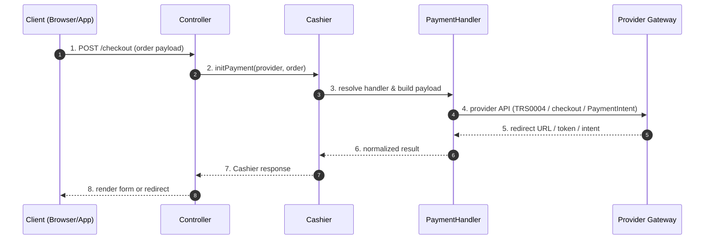
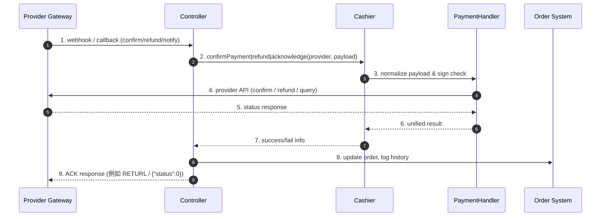

# Cashier 全金流實戰指南

> 對象：剛接觸 F3CMS 金流模組的工程師，希望用同一支 `F3CMS\Cashier` 搭配 **CUBE / Line Pay / Stripe / Tappay**。
>
> 這篇統整四份個別文件，示範如何共用 Sample Order、DI 註冊 Handler、並依 Scenario 呼叫不同金流。

## 前置條件
- PHP 8.1+ 與 `composer install` 後的 `vendor/autoload.php`。
- `www/f3cms/libs/Autoload.php` 已載入。
- 將各金流 Helper 透過 Service Container 或簡單陣列注入 Cashier。

### 必填環境變數
| Provider | 需要的變數 |
| --- | --- |
| CUBE | `CUBE_STORE_ID`, `CUBE_CUB_KEY` |
| Line Pay | `LINE_CHANNEL_ID`, `LINE_CHANNEL_SECRET` |
| Stripe | `STRIPE_SECRET_KEY`, `STRIPE_WEBHOOK_SECRET`, `STRIPE_PRICE_ID`, `STRIPE_TEST_PAYMENT_METHOD` |
| Tappay | `TAPPAY_API_MERCHANT`, `TAPPAY_API_SECRET`, `TAPPAY_API_BANK` |

### 共用 Sample Order（節錄）
```json
{
  "id": 26,
  "member_id": 2,
  "order_no": "TX3M7QTLAXXN_3MKTL",
  "amount": 800,
  "buyer": { "name": "本本", "email": "aquqfish2728@gmail.com" },
  "items": [{"qty": 1, "price": 800, "title": "full_price - 瑜珈睡眠術(11-07 15:30)"}],
  "status": "New"
}
```

## 建立 Cashier 與四個 Handler
```php
require_once __DIR__ . '/../vendor/autoload.php';
require_once __DIR__ . '/../libs/Autoload.php';

use F3CMS\Cashier;
use F3CMS\PaymentHandler\{CUBEhelper, LinePayHelper, StripeHelper, TPPhelper};

$order = json_decode($orderJson, true, 512, JSON_THROW_ON_ERROR);

$cashier = new Cashier([
    'cube'    => new CUBEhelper(getenv('CUBE_STORE_ID'), getenv('CUBE_CUB_KEY')),
    'linepay' => new LinePayHelper(getenv('LINE_CHANNEL_ID'), getenv('LINE_CHANNEL_SECRET')),
    'stripe'  => new StripeHelper(
        getenv('STRIPE_SECRET_KEY'),
        getenv('STRIPE_WEBHOOK_SECRET'),
        ['stripe_version' => '2023-10-16']
    ),
    'tpp'     => new TPPhelper(),
]);
```
> 控制器只需記得 provider alias 與場景（`Cashier::SCENARIO_*`）。以下分別介紹常用場景。

## Cashier API 呼叫序列 (Mermaid)

### 1. Init Flow（建立付款）


### 2. Confirm / Refund / ACK Flow


## CUBE (EPOS)
- **Scenario 對應：** init → TRS0004、query → ORD0001、ack → ACK XML、verify → 背景通知。
- **初始化付款頁**
  ```php
  $formHtml = $cashier->initPayment('cube', [
      'order'   => $order,
      'options' => ['language' => 'ZH-TW', 'form_id' => 'cub_epos_form'],
  ]);
  ```
- **查詢訂單**：使用 `preparePaymentPayload()` 產生合法欄位，再呼叫 `queryTransaction`。
- **Callback**：`acknowledgeCallback` 產出合法 RETURL；`verifyCallback` 驗簽後回傳授權結果。
- **排錯重點**：`L100` 通常是訂單編號格式不符；每日 00:00–01:00 不可呼叫。

## Line Pay
- **Scenario 對應：** `initPayment` → checkout、`confirmPayment` → confirm、`refundPayment` → refund。
- **組商品列表**
  ```php
  $products = array_map(static fn ($item) => [
      'name' => $item['title'], 'quantity' => (int) $item['qty'], 'price' => (int) $item['price'],
  ], $order['items']);
  ```
- **Checkout**
  ```php
  $checkoutPayload = [
      'amount'       => (int) $order['amount'],
      'currency'     => 'TWD',
      'orderId'      => $order['order_no'],
      'packages'     => [[
          'id'       => 'pkg-' . $order['id'],
          'amount'   => (int) $order['amount'],
          'products' => $products,
      ]],
      'redirectUrls' => [
          'confirmUrl' => 'https://merchant.example/cashier/linepay/confirm',
          'cancelUrl'  => 'https://merchant.example/cashier/linepay/cancel',
      ],
  ];

  $checkoutResponse = $cashier->initPayment('linepay', $checkoutPayload);
  $transactionId    = $checkoutResponse['info']['transactionId'];
  ```
- **Confirm & Refund**：金額/幣別必須與 checkout 一致。
- **排錯重點**：`1172` 表示套餐金額不相符； callback URL 需 HTTPS。

## Stripe
- **Scenario 對應**：`initPayment` → PaymentIntent create、`confirmPayment` → confirm、`subscriptionCreate` → 週期扣款、`verifyWebhook/constructWebhook` → 驗證事件。
- **建立 Payment Intent**
  ```php
  $intentPayload = [
      'amount'               => (int) $order['amount'],
      'currency'             => 'twd',
      'payment_method_types' => ['card'],
      'description'          => sprintf('%s (%s)', $order['items'][0]['title'] ?? 'Plan', $order['order_no']),
      'metadata'             => ['order_id' => (string) $order['id']],
  ];

  $intent = $cashier->initPayment('stripe', $intentPayload);
  ```
- **Confirm**：
  ```php
  $cashier->confirmPayment('stripe', [
      'id'      => $intent->id,
      'payload' => ['payment_method' => getenv('STRIPE_TEST_PAYMENT_METHOD') ?: 'pm_card_visa', 'confirm' => true],
  ]);
  ```
- **Subscription**：先 `createCustomer`、`attachPaymentMethod`，再 `subscriptionCreate`，可展開 `latest_invoice.payment_intent`。
- **Webhook**：`verifyWebhook` (bool) + `constructWebhook` (Event object)，可套在任何 controller。
- **排錯重點**：`authentication_required` 需前端完成 3DS；`invalid_request_error` 多為金額非整數或 currency 錯誤。

## Tappay (TPP)
- **Scenario 對應**：`initPayment` → pay-by-prime、`queryTransaction` → transaction.query、`refund` → pay_by_prime/refund、`acknowledgePayment` → 通知回覆。
- **pay_by_prime**
  ```php
  $startPayload = [
      'prime'        => 'test_prime',
      'amount'       => (int) $order['amount'],
      'currency'     => 'TWD',
      'details'      => sprintf('%s (%s)', $order['items'][0]['title'] ?? 'Plan', $order['order_no']),
      'order_number' => $order['order_no'],
      'cardholder'   => [
          'phone_number' => $order['buyer']['mobile'] ?: '+886900000000',
          'name'         => $order['buyer']['name'] ?: 'Demo User',
          'email'        => $order['buyer']['email'] ?: 'demo.user@example.com',
      ],
  ];

  $response   = $cashier->initPayment('tpp', $startPayload);
  $recTradeId = $response['rec_trade_id'] ?? '';
  ```
- **Query**：`start_time`/`end_time` 用 ISO8601，如 `date('c', strtotime('-7 days'))`。
- **Refund**：`refund('tpp', ['rec_trade_id' => $recTradeId, 'amount' => ...])`；需已啟用銀行參數。
- **Notify ACK**：`acknowledgePayment` 會回傳標準 `{"status":0}` 回應，直接 echo。
- **排錯重點**：`status 12412` 代表 merchant/partner key 錯； prime 90 秒內有效。

## 常見整合 Tips
- **Service Container**：註冊 Cashier 成 singleton，即可在 Controller/Queue/Job 取得同一組 handlers。
- **Scenario 命名**：盡量使用 `Cashier::SCENARIO_*` 常數，切換金流時才能共用呼叫流程。
- **日誌**：建議把 `provider + scenario + payload` 記錄在統一 channel，方便追查跨金流問題。
- **測試**：先於 sandbox (Line Pay/Tappay) 或 test mode (Stripe) 驗證，最後再切換正式環境變數。

> 想了解每個金流更完整的參數與回傳，可回頭查看各自的 `cube_usage.md`、`linepay_usage.md`、`stripe_usage.md`、`tpp_usage.md`，本篇專注在「如何透過 Cashier 跑通全部情境」。
