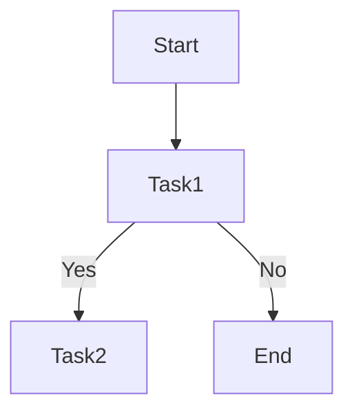
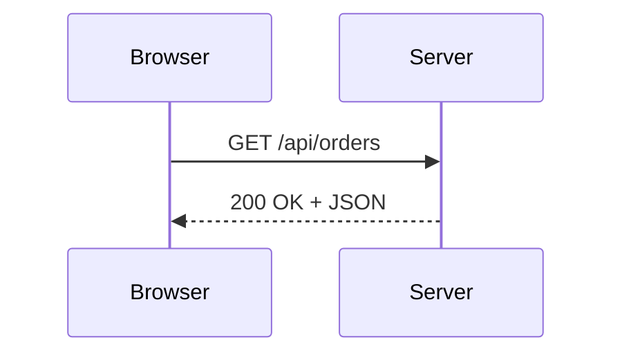

# Markdown & Docsify 快速教學

> 本指南說明三個層面：
> 1. 基礎 Markdown 語法（標題、清單、程式碼區塊、表格）。
> 2. `docsify-plugin-flexible-alerts` 的 Callout 格式。
> 3. Mermaid 流程圖／序列圖的基本寫法。

## 1. 基礎 Markdown 語法

### 標題與文字格式
```markdown
# H1 標題
## H2 標題
### H3 標題

**粗體**、*斜體*、`行內程式碼`
```

### 清單
```markdown
- 無序清單項目
  - 巢狀項目
1. 有序清單第一項
2. 有序清單第二項
```

### 程式碼區塊
```markdown
```bash
npm install
```

> 使用三個反引號 ``` 包住程式碼，並在後方指定語言（如 `bash`, `php`）即可觸發 Prism 高亮。

### 表格
```markdown
| 欄位 | 說明 |
| --- | --- |
| host | 主機名稱 |
| port | 連接埠 |
```

## 2. Flexible Alerts Callout
`docsify-plugin-flexible-alerts` 讓你用簡短語法產生資訊、警告、成功提示等框線。

```markdown
> [!NOTE]
> 這是一般說明文字。

> [!TIP]
> 可提醒讀者「設定環境變數後要重啟」。

> [!WARNING]
> 警告用語法適合放在風險/權限相關小節。
```

支援的種類包含 `NOTE`, `TIP`, `WARNING`, `ATTENTION`, `SUCCESS` 等，實際樣式取決於 `flexibleAlerts.style` 設定（此專案為 `callout`）。

## 3. Mermaid 基本語法
在 Docsify 中可使用 ```mermaid 區塊撰寫流程圖或序列圖。

### 流程圖 (Flowchart)
```markdown



### 序列圖 (Sequence Diagram)
```markdown



> Mermaid 會依 `window.$docsify.mermaidConfig` 設定自動渲染。若圖表過大，可搭配 `docsify-mermaid-zoom` 拖曳放大。

---
若你需要更進階的 Markdown 技巧（如腳註、表情符號、自訂 CSS）或更多 Mermaid 圖表類型，可參考：
- [Markdown Guide](https://www.markdownguide.org/basic-syntax/)
- [Flexible Alerts Docs](https://github.com/fzankl/docsify-plugin-flexible-alerts)
- [Mermaid 官方文件](https://mermaid.js.org/)
- [Mermaid Playgrount](https://mermaid.live/edit)
