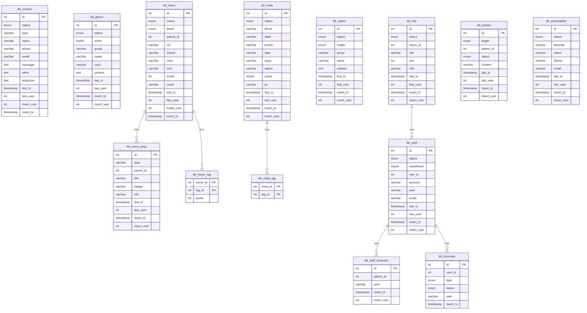

# F3CMS 整體說明

## Purpose
- 用整體架構與業務適用性來說明 F3CMS 是什麼。
- 幫助 staff、SA 與架構師快速判斷 F3CMS 是否適合特定網站專案。
- 說明 F3CMS 在中小型網站、內容型網站與一般性政府網站上的實務優勢。

## Primary Readers
- 業主端 staff
- SA
- 架構師
- 需要快速理解系統定位的技術決策者

## Scope
- F3CMS 的產品定位
- 為什麼它適合中小型網站與一般性政府網站
- 與 WordPress 類型方案的差異
- Hierarchical FORK 架構與資料模型概觀
- 既有核心模組與 ERD 參考

## LLM Reading Contract
- 將本文件視為 F3CMS 的整體定位與架構敘事入口，而不是逐段操作手冊。
- 若問題涉及模組切分、資料建模、Feed 行為或 SD 實作，應轉讀對應的新 guides。
- 若本文件與較新的操作型指南有重疊，優先採用新 guides 作為實作依據。

## Inputs
- [index.md](index.md)
- [sa_requirement_breakdown.md](sa_requirement_breakdown.md)
- [data_modeling.md](data_modeling.md)
- [module_design.md](module_design.md)
- [feed_guide.md](feed_guide.md)

## Core Thesis
- F3CMS 不是為了做出「最通用、最容易安裝外掛」的 CMS，而是為了做出「在客製需求、多語系、權限、資料結構與長期維運上更可控」的 CMS。
- 對中小型網站與一般性政府網站來說，真正的風險通常不是網站上線本身，而是上線後數年的需求變更、承辦人更替、委外廠商交接、資料結構擴充與後台流程持續調整。
- F3CMS 的價值就在於：它把這些長期成本前移到架構設計階段，以較清楚的模組邊界、資料模型與層級責任，換取後續維護與擴充的穩定性。

## 一句話理解 F3CMS

F3CMS 是一套以實體、模組與資料模型為核心的 CMS，特別適合需要客製內容結構、後台流程、多語系與長期維運的網站專案。

如果專案只是極簡形象頁、單純套版官網，且幾乎不會有後續客製需求，WordPress 仍然可能是更快的方案。但如果專案需要明確的資料結構、穩定的擴充邊界、可預期的後台設計與長期交接能力，F3CMS 通常會是更穩健的選擇。

## 為什麼 F3CMS 特別適合中小型網站

這裡的「中小型網站」不是指功能很少，而是指專案規模與預算通常不足以支撐大型平台級架構，卻又不能只靠套版與外掛堆疊完成。

常見場景包括：
- 企業官網
- 品牌網站
- 組織或協會官網
- 新聞公告型網站
- 學校、基金會、醫療單位、地方機關入口網站
- 具有單頁、文章、分類、檔案下載、表單與多語系需求的網站

F3CMS 在這類場景的優勢主要來自以下幾點。

### 1. 結構比外掛堆疊更可控

許多中小型網站在初期需求看似單純，但實際上很快會出現：
- 自訂欄位
- 多種內容類型
- 多層選單
- 多角色後台
- 上稿流程
- 多語系頁面
- 客製搜尋與列表條件

這些需求在 WordPress 上通常會逐步依賴佈景、外掛、自訂文章型別與各種附加套件來完成。短期上線速度可能很快，但長期常見的代價是：
- 資料結構分散
- 相依套件過多
- 權限與流程難以精確控制
- 換廠商或換工程師後理解成本偏高

F3CMS 則傾向一開始就把資料模型、模組邊界與責任分層定義清楚，因此在後續維護時較不容易變成拼裝式系統。

### 2. 後台與資料模型比較容易一起設計

對 SA 與架構師來說，中小型網站常見的困難不是畫不出頁面，而是頁面背後其實對應多個資料實體與維護流程。

F3CMS 的模組設計方式讓需求可以從以下順序展開：
- 先確認實體
- 再確認資料表與語系、meta、relation 結構
- 再確認後台動作與頁面

這種順序對客製網站尤其重要，因為它能避免 UI 先行而導致資料結構失真。

### 3. 後續擴充成本通常比較低

中小型網站最常見的真實狀況是：
- 第一年先上線基本內容
- 第二年加欄位、加流程、加新模組
- 第三年換承辦人或換廠商後，又補一批功能

若系統一開始就沒有清楚的模組邊界與資料邏輯位置，這些後續需求會快速累積成維護債。F3CMS 採用模組化與分層設計，目的就是讓後續需求能沿著既有結構延伸，而不是每次都從頁面反推資料。

## 為什麼 F3CMS 適合一般性政府網站

這裡的「一般性政府網站」指的是以資訊公開、公告、單位介紹、服務說明、檔案下載、表單收件、新聞發布、FAQ、選單階層與多語系為主的網站，而不是超大型跨部會平台或高度交易型系統。

這類網站通常重視的不是炫技，而是：
- 架構清楚
- 內容維護穩定
- 權限與責任容易界定
- 多語系支援
- 長期維運與交接
- 需求追加時不需要推翻重做

F3CMS 在這些條件下特別有說服力。

### 1. 較適合有制度感的資訊架構

政府網站常見的內容型態具有明確結構，例如：
- 單位介紹
- 最新消息
- 法規或文件下載
- 常見問答
- 專案或計畫頁面
- 分類與標籤導向的內容整理

F3CMS 以實體與模組為核心，較容易把這些內容型態整理成穩定的資料結構，而不是依賴頁面編輯器自由拼接。

### 2. 比較有利於承辦、委外與交接

政府網站的常態不是只做一次，而是要面對：
- 承辦人輪替
- 委外廠商更換
- 維護案延續
- 年度預算分期執行

在這種情境下，越依賴隱性規則、特定外掛組合或單一工程師個人習慣，交接成本就越高。F3CMS 的優勢在於它用固定的模組結構、表命名規則與資料分層，讓後續接手者更容易理解系統。

### 3. 多語系、角色與內容治理比較自然

一般性政府網站很常需要：
- 中英文或多語系內容
- 不同單位或角色分工維護
- 清楚的上稿與權限規則
- 資料更新與追蹤欄位

F3CMS 的資料模型原生就重視 `_lang`、`_meta`、relation table 以及常見 audit 欄位，這使它在設計內容治理時，比純頁面導向系統更容易維持一致性。

## 為什麼可以考慮用 F3CMS 取代 WordPress

這裡不是要否定 WordPress，而是要指出兩者適用前提不同。

### WordPress 比較適合的情境
- 快速上線的標準型官網
- 幾乎不需要特殊資料模型
- 內容管理以頁面與文章為主
- 團隊高度依賴成熟佈景與外掛生態

### F3CMS 比較適合的情境
- 需要客製資料結構
- 需要將內容、語系、meta、relation 拆清楚
- 需要明確的模組與權限邊界
- 需要長期維運與可交接性
- 需要將一般網站功能與專屬業務流程整合在同一套系統中

### 對決策者最重要的差異

WordPress 的優勢通常在「快」；F3CMS 的優勢通常在「穩」。

更精確地說：
- WordPress 比較擅長以既有生態縮短初期建置時間
- F3CMS 比較擅長在客製需求逐年累積時維持結構穩定

如果專案預期會持續增修、整併功能、增加角色、增加欄位、增加內容類型，F3CMS 往往比 WordPress 更值得作為主體架構。

## 對 Staff、SA 與架構師各自的價值

### 對 Staff
- 後台結構較容易跟實際業務內容對齊
- 欄位、模組與內容類型不容易因外掛累積而失控
- 後續功能追加時，比較不需要整站重做

### 對 SA
- 可用實體與模組來拆需求，而不是被頁面先綁住
- 比較容易把需求轉成資料表、角色、操作流程與後台功能
- 有助於提升需求文件與技術設計之間的一致性

### 對架構師
- 分層責任較清楚，較容易控制邊界與長期演化方向
- 資料模型與模組結構較一致，便於治理與 code review
- 適合需要平衡交付速度、客製彈性與維運可控性的專案

## F3CMS 的設計立意與目的

F3CMS 的核心目標，不是把網站做成大型框架展示，而是提供一套對實務交付更友善的結構化 CMS。其主要目的包括：
- **避免傳統 MVC 在大型或長期演化專案中的缺點**：尤其是 View 與 Controller 責任混雜後，造成頁面邏輯、資料邏輯與互動邏輯交錯堆疊。
- **提升系統模組化與可擴充性**：透過清楚的模組邊界與分層責任，讓新增需求可以沿著既有結構擴充，而不是破壞原有系統。
- **優化一般內容網站的交付效率**：讓常見的文章、單頁、分類、標籤、選單、權限、多語系等需求，能在同一套一致的架構下處理。
- **降低長期維運風險**：在承辦輪替、委外交接、功能增修時，仍能維持可理解、可維護的系統形狀。

以下將詳細說明 F3CMS 的架構、資料模型與既有模組範圍。

### Hierarchical FORK 架構
F3CMS 採用其獨特的 **Hierarchical FORK 架構** 設計。此架構將系統劃分為以下核心組件，這些組件被封裝在層次結構中，每個單元由專屬組件構成，且單元之間可以互相嵌套，實現更細緻的邏輯分離和元件重用：

*   **資料提供 (Feed)**
    *   **職責**：負責實體的資料層操作，例如常見的 **新增、刪除、修改、查詢 (CRUD)** 等。
    *   **特性**：每個實體都配有專屬的 Feed 層，處理特定功能的數據管理和少量資料邏輯。
*   **頁面回饋 (Outfit)**
    *   **職責**：負責管理表現層，處理頁面呈現的 **商業邏輯**，並協調資料提供者 (Feed) 和視覺主題 (Theme) 之間的互動。
    *   **特性**：每個實體都有專屬的 Outfit，能夠獨立處理用戶的頁面請求。
*   **互動反應 (Reaction)**
    *   **職責**：專門負責處理 **AJAX 等互動式呼叫**，並以 **JSON 格式回應**。
    *   **特性**：配合使用異步技術或 WebSocket，有效提高用戶體驗和系統性能，使操作反應更快速、即時和流暢。
*   **工具箱 (Kit)**
    *   **職責**：封裝該模組的規則與邏輯，作為該模組的可重用能力邊界，並可供其他模組呼叫使用。
    *   **特性**：Kit 承接的是 module-owned 規則，不是泛用基礎設施；若邏輯仍屬單一模組邊界，即使被跨模組重用，也優先留在該模組 Kit，以避免 `libs` 過度肥大。
*   **視覺主題 (Theme)**
    *   **職責**：負責 **產出 HTML 碼** 供頁面回饋 (Outfit) 使用。
    *   **特性**：採用 **模板引擎** 將 HTML 獨立出來，以避免傳統 MVC 視圖 (View) 層可能產生的「Spaghetti code」問題，使系統架構更清晰、維護更方便。

#### Hierarchical FORK 架構的優勢
Hierarchical FORK 架構的主要優勢在於：
*   **降低耦合度**：其層次化的組織方式有助於減少各層之間的耦合度。
*   **提升可維護性與可測試性**：有助於提升系統的長期可維護性和可測試性。
*   **提高開發效率與系統效能**：資料提供 (Feed) 的獨立性和一致的資料架構，以及工具箱 (Kit) 對模組規則封裝與重用的管理，能減少開發工作，提高整體開發效率和系統效能。
*   **強化動態處理能力**：結合互動反應 (Reaction) 組件，進一步強化了系統的動態處理能力，以滿足現代應用程式的即時互動需求。

### Hierarchical FORK 架構與傳統 MVC 模型的對比
Hierarchical FORK 是 F3CMS 針對傳統 MVC 模型在處理大型應用程式時可能出現的弊端（例如視圖層的「Spaghetti code」）所提出的一種 **改良型架構**。下表總結了兩者之間的關鍵差異：

| 特點 | 傳統 MVC 模型 | Hierarchical FORK 架構 |
| :------- | :------- | :------- |
| **設計目的** | 一種軟體設計模式，將應用程式劃分為模型、視圖、控制器，以分離關注點。 | 旨在 **避免傳統 MVC 模型的缺點**，提升模組化、易維護性和可擴充性。 |
| **結構** | 模型（資料與業務邏輯）、視圖（使用者介面）、控制器（處理輸入、更新模型和視圖）。 | 將系統劃分為 **資料提供 (Feed)、頁面回饋 (Outfit)、互動反應 (Reaction) 和工具箱 (Kit)** 等核心組件，並引入 **視覺主題 (Theme)**。 |
| **View 處理** | 視圖可能直接包含 HTML 和呈現邏輯，易產生 **「Spaghetti code」**。 | 引入 **視覺主題 (Theme)**，將 HTML 碼獨立出來，由 **模板引擎** 建構，避免 View 層的程式碼混亂。 |
| **互動處理** | 控制器通常負責處理使用者輸入和頁面導航。 | 引入 **互動反應 (Reaction)** 組件，專門處理 **AJAX 呼叫** 並以 JSON 格式回應，強化即時互動能力。 |
| **層次關係** | 模型、視圖、控制器之間的交互通常是較為扁平的。 | 採用 **清晰的層級結構**，組件之間可以互相嵌套，實現更細緻的邏輯分離。 |
| **優勢** | 分離關注點，提高程式碼組織。 | 降低各層之間的 **耦合度**，提升 **可維護性、可測試性、開發效率和系統效能**，並強化 **動態處理能力**。 |

### 資料模型與模組概述
F3CMS 的實體關係模型 (ERD) 清晰展示了多種已有的內容管理及系統功能模組，並具備強大的 **多語系支援能力**。其預設資料表結構以 WordPress 為基礎並經過強化，能更有效地區別存放不同屬性資料。

在簡化後的類別圖中，F3CMS 的資料模型設計理念整合了以下概念：
*   **本地化內容 (語言相關表)**：語言相關表 (如 `tbl_X_lang`) 儲存多種語言內容 (如標題、摘要、內容)，這些屬性被視為其父類別的 **本地化內容** 屬性集合。
*   **中繼資料 (中繼資料表)**：中繼資料表 (如 `tbl_X_meta`) 以鍵值對 (`k`, `v`) 形式儲存額外資訊，被歸納為父類別的 **中繼資料** 屬性 (可擴展的鍵值對集合)。
*   **關聯**：關聯表 (如 `tbl_X_Y`) 用於建立多對多關係，在類別圖中直接轉換為類別之間的 **關聯** (例如「擁有多個」或「關聯多個」)。
*   **時間戳記與使用者資訊**：每個類別通常包含 `last_ts` (最後更新時間), `last_user` (最後更新使用者), `insert_ts` (插入時間), `insert_user` (插入使用者) 等通用屬性，方便進行資料追蹤與審計。
*   **階層式資料管理**：`menu` 和 `tag` 等資料表透過 `parent_id` 欄位實現了 **遞迴關聯**，允許建立巢狀選單結構和階層式標籤，有助於更靈活地組織和管理內容。

F3CMS 的模組並不是單純的功能選單，而是對應實際網站營運所需的業務單元。對非工程角色來說，可以先把它理解成三層。

## 模組清單的分層摘要

### 第一層：你可以把 F3CMS 看成三大能力區塊

#### 1. 內容營運模組
這一層負責網站真正要對外呈現與持續維護的內容。

典型用途包括：
- 單頁內容
- 新聞與公告
- 作者與書籍等內容關聯
- 分類、標籤、搜尋
- 媒體與素材管理

這一層是多數企業網站、品牌網站與政府網站最常用的核心。

#### 2. 網站治理模組
這一層負責網站如何被管理，而不只是網站上有什麼內容。

典型用途包括：
- 後台帳號與角色
- 權限與登入
- 選單管理
- 系統設定
- 共用 meta 規則

對 staff 與承辦單位來說，這一層通常直接影響網站是否容易維運與交接。

#### 3. 擴充與追蹤模組
這一層負責補足實務專案中常見但不一定每站都一樣的能力。

典型用途包括：
- 聯絡表單收件
- 訂閱
- 串流或追蹤資訊
- 搜尋紀錄
- 內容追蹤紀錄

這一層的價值在於讓網站不是只有展示內容，而是能逐步長成可管理、可追蹤、可延伸的系統。

### 第二層：用網站業務語言來看，F3CMS 大致支援哪些工作

如果不用資料表名稱，而用業務角度來看，F3CMS 大致涵蓋以下幾類工作。

#### A. 內容發布
- 單頁與文章發布
- 新聞、公告、專案內容管理
- 多語系內容維護
- 封面、版型、上線時間與狀態控管

#### B. 內容整理與導覽
- 分類
- 標籤
- 選單階層
- 搜尋與內容關聯

#### C. 素材與附屬資料管理
- 媒體與圖片素材
- 額外屬性與 meta 資訊
- 作者、書籍、術語等內容關聯對象

#### D. 後台治理與帳號權限
- staff 帳號
- role 與權限
- 登入與憑證管理
- 系統選項與共用設定

#### E. 網站互動與營運補充
- 聯絡表單
- 訂閱資料
- 廣告管理
- 追蹤紀錄與營運輔助資料

這樣的分法有助於非工程角色先理解：F3CMS 並不是只有文章管理，而是一套足以支撐一般網站日常營運的完整內容系統。

### 第三層：對 SA 與架構師更有用的模組族群摘要

若需要再往下看一層，可以把現有模組分成以下族群。

#### 內容主體模組
- Post
- Press
- Category
- Tag
- Search

這些模組共同構成一般網站最核心的內容發布、分類整理與查找能力。

#### 內容關聯與延伸模組
- Author
- Book
- Dictionary
- Term
- PressTrace

這些模組讓內容不是單一頁面，而是可關聯、可追蹤、可延伸的內容網絡。

#### 素材與曝光模組
- Media
- Advertisement

這些模組負責素材資產與曝光資源的管理，常見於品牌網站、活動網站或政府宣導網站。

#### 後台治理模組
- Staff
- Role
- Doorman
- Menu
- Option
- Meta

這些模組決定後台是否能穩定分工、控權與交接，也是政府網站與中大型內容站很重要的一層。

#### 網站互動與營運模組
- Contact
- Subscription
- Stream
- Genus

這些模組用來承接一般網站在實際營運中常見的互動資料與附加管理需求。

## 模組明細對照

如果前面的摘要是給非工程角色快速建立全貌，下面這份明細則是讓讀者知道 F3CMS 已經具備哪些典型網站能力。

#### 內容與 CMS 相關模組
- **Advertisement (廣告)**：管理廣告的狀態、權重、曝光與起訖時間，適合宣導版位或首頁曝光管理。
- **Author (作者)**：管理作者或內容來源人物資訊，可與文章內容建立關聯。
- **Book (書籍)**：管理書籍或出版品資訊，常用於出版、教育或內容型網站。
- **Category (分類)**：提供內容分類結構，支援多語系標題與資訊。
- **Dictionary (字典)**：管理詞條或名詞型內容，適合知識型或說明型網站。
- **Media (媒體庫管理)**：管理圖片或素材，支援附加 metadata 與標籤。
- **Post (文章/單頁)**：管理固定單頁與一般內容頁。
- **Press (新聞稿/媒體報導管理)**：管理新聞、公告、專案報導等較完整的內容型態。
- **PressTrace (文章追蹤記錄)**：補充內容追蹤與歷程用途。
- **Search (搜尋)**：管理搜尋資料與搜尋結果對應。
- **Tag (標籤管理)**：管理標籤與相關內容整理。

#### 核心治理與營運模組
- **Contact (聯絡表單管理)**：管理網站收件與回覆資訊。
- **Doorman (門衛)**：管理登入或憑證記錄。
- **Genus (類別)**：管理一般性分類資料。
- **Menu (選單管理)**：管理網站導覽與階層式選單。
- **Meta (通用中繼資料定義)**：管理共用 metadata 規則與欄位定義。
- **Option (系統選項管理)**：管理網站層級設定與參數。
- **Role (角色)**：管理角色與後台權限。
- **Staff (員工/用戶管理)**：管理後台維護人員帳號。
- **StaffFootmark (員工足跡/密碼歷史)**：補充帳號治理與安全追蹤。
- **Stream (串流)**：管理串流或即時資料型內容。
- **Subscription (訂閱)**：管理訂閱者資料。

### F3CMS 的主要優點 (總結)
F3CMS 藉由其獨特的 Hierarchical FORK 架構設計和靈活的資料模型，帶來了以下多方面的優點：
*   **高度模組化與可擴充性**： Hierarchical FORK 架構將系統劃分為清晰的組件，並基於 Web 的多層式開發 (N-Tier 架構) 設計，實現高靈活性與擴展彈性，有助於降低資源消耗，同時大幅提升系統的負載能力與運作效率。
*   **提升可維護性與可測試性**： Hierarchical FORK 的層次化組織方式有效降低各層之間的耦合度，各組件職責明確，且視覺主題 (Theme) 分離 HTML 部分，採用模板引擎，避免了「Spaghetti code」，使程式碼更易於理解、維護和測試。
*   **提高開發效率與系統效能**：資料提供 (Feed) 的獨立性、工具箱 (Kit) 的共用程式碼管理以及互動反應 (Reaction) 組件對 AJAX 呼叫的強化處理，共同提升了開發效率和系統性能，提供快速、即時、流暢的操作反應。
*   **強大的內容管理與多語系支援**： F3CMS 具有高彈性的資料結構，支援各種資料表設計，並透過多個核心資料表的 `_lang` 對應表提供全面的 **多語系支援能力**。`parent_id` 欄位實現的階層式資料管理 (如選單和標籤)，以及詳細的資料追蹤欄位，都強化了內容管理的靈活性和可控性。

總而言之，F3CMS 的設計理念使其能夠提供一個高彈性、高效能、易於開發與維護，且良好支援多語系與複雜內容管理的現代化 Web 應用程式框架。

## 從商務價值過渡到技術結構

如果前面的內容是在回答「為什麼要選 F3CMS」，那接下來的內容則是在回答「F3CMS 憑什麼能做到這些事」。

對 staff 而言，前面看到的是交付穩定性、後台可治理性、長期維運與交接成本的優勢。對 SA 而言，前面看到的是需求可以用實體、模組、角色與資料結構來拆解，而不是只能從頁面與功能表列舉。對架構師而言，前面看到的是模組邊界、分層責任與資料模型的一致性。

而這些優勢不是抽象口號，它們都必須落在可檢查的技術結構上，包含：
- 實體如何對應到模組
- 模組如何切分 Feed、Reaction、Outfit、Kit 的責任
- 主表、語系表、meta 表與 relation table 如何分工
- 權限、追蹤欄位、多語系與內容關聯如何在資料層被穩定表達

因此，下面的 ERD 與模組清單不只是技術附錄，而是 F3CMS 商務價值的結構化證據。它們展示的是：當需求要從「一般網站功能」走向「可持續維運的內容系統」時，系統如何用清楚的資料模型與模組設計把複雜度收斂下來。

如果讀者目前的關注點是選型與整體可行性，讀到這裡已經足以建立判斷基礎。若接下來要進一步討論需求拆解、資料建模或新模組設計，則可以把下面的 ERD 當成整體地圖，再回到 [sa_requirement_breakdown.md](sa_requirement_breakdown.md)、[data_modeling.md](data_modeling.md) 與 [module_design.md](module_design.md) 做更精確的操作性閱讀。

## ERD 與資料表閱讀說明

本節的目的，不是要求非工程角色逐欄位閱讀每一張表，而是讓讀者知道 F3CMS 如何把網站需求拆成穩定的資料結構。

如果前面的章節回答的是「F3CMS 適不適合這個專案」，那這一節回答的是「它實際把網站資料整理成什麼樣子」。

### 先理解什麼是「表」

在這裡，所謂的「表」，就是資料庫裡用來存放一類資料的結構單位。可以把它理解成一種穩定的資料容器。每一張表通常對應某一種實體、某一類附屬資料，或某一種關聯關係。

對非工程角色來說，可以先用下面幾種方式理解 F3CMS 的表。

#### 1. 主表
- 用來存放一個實體最核心、最穩定的資料
- 例如狀態、代稱、封面、排序、建立與更新資訊
- 常見命名為 `tbl_xxx`

例子：
- `tbl_post`
- `tbl_press`
- `tbl_staff`

#### 2. 語系表
- 用來存放會隨語言改變的內容
- 例如標題、摘要、內文、資訊說明
- 常見命名為 `tbl_xxx_lang`

例子：
- `tbl_post_lang`
- `tbl_press_lang`
- `tbl_menu_lang`

#### 3. Meta 表
- 用來存放較彈性、附屬性質、延伸性的欄位
- 適合 SEO、補充設定、可擴充屬性
- 常見命名為 `tbl_xxx_meta`

例子：
- `tbl_post_meta`
- `tbl_press_meta`
- `tbl_media_meta`

#### 4. 關聯表
- 用來表示兩種實體之間的關聯
- 特別常見於多對多關係
- 常見命名為 `tbl_xxx_yyy`

例子：
- `tbl_post_tag`
- `tbl_press_author`
- `tbl_search_press`

#### 5. 追蹤或附屬表
- 用來記錄歷程、延伸事件、特殊補充資料
- 不是每個模組都會有，但在需要追蹤或附加管理時很重要

例子：
- `tbl_press_log`
- `tbl_staff_footmark`

### 如何閱讀下面的 ERD

閱讀這些圖時，不需要一開始就看每個欄位型別。建議按以下順序看：
- 先看有哪些主表，這代表系統有哪些核心實體
- 再看哪些主表旁邊帶有 `_lang`、`_meta`、relation table，這代表它的延伸程度與治理需求
- 最後再看角色、選單、權限、設定等核心治理表，理解整個後台如何被管理

若用決策角度來看：
- staff 可以關注系統是否具備自己需要管理的內容種類
- SA 可以關注網站需求是否能被拆成清楚的實體與關聯
- 架構師可以關注資料模型是否足夠穩定、可維運、可擴充

### ERD 分區

下面的 ERD 分成兩大區：
- CMS 區：偏向內容本體、內容關聯、搜尋、媒體與發布能力
- 核心區：偏向後台治理、帳號角色、選單、設定與網站營運輔助資料

### CMS 區：內容與發布能力的資料表

這一區可以理解為「網站真正對外提供的內容骨架」。

如果從業務角度來看，這區主要支撐的是：
- 文章與單頁
- 新聞、公告與報導
- 分類與標籤
- 搜尋與內容整理
- 作者、書籍、字典等關聯內容
- 素材與廣告曝光

如果從表的角度來看，這區常見的表分工如下：
- 主表：`tbl_post`、`tbl_press`、`tbl_category`、`tbl_tag`、`tbl_media`
- 語系表：`tbl_post_lang`、`tbl_press_lang`、`tbl_category_lang`、`tbl_tag_lang`
- Meta 表：`tbl_post_meta`、`tbl_press_meta`、`tbl_media_meta`
- 關聯表：`tbl_post_tag`、`tbl_press_author`、`tbl_press_book`、`tbl_press_tag`
- 記錄表：`tbl_press_log`

#### CMS ERD

```mermaid
erDiagram

    tbl_adv {
        int id PK
        int position_id
        int counter
        int exposure
        enum status
        int weight
        varchar theme
        timestamp start_date
        timestamp end_date
        varchar uri
        varchar cover
        varchar background
        timestamp last_ts
        int last_user
        int insert_user
        timestamp insert_ts
    }

    tbl_adv_lang {
        int id PK
        varchar lang
        int parent_id
        varchar title
        varchar subtitle
        text content
        timestamp last_ts
        int last_user
        timestamp insert_ts
        int insert_user
    }

    tbl_adv_meta {
        int id PK
        int parent_id
        timestamp last_ts
        varchar k
        text v
    }

    tbl_author {
        int id PK
        enum status
        varchar slug
        date online_date
        int sorter
        varchar cover
        timestamp last_ts
        int last_user
        timestamp insert_ts
        int insert_user
    }

    tbl_author_lang {
        int id PK
        varchar lang
        int parent_id
        varchar title
        varchar jobtitle
        varchar slogan
        varchar summary
        text content
        timestamp last_ts
        int last_user
        timestamp insert_ts
        int insert_user
    }

    tbl_author_tag {
        int author_id PK
        int tag_id PK
    }

    tbl_book {
        int id PK
        enum status
        int cate_id
        int counter
        int exposure
        varchar uri
        varchar cover
        timestamp last_ts
        int last_user
        timestamp insert_ts
        int insert_user
    }
    
    tbl_book_lang {
        int id PK
        varchar lang
        int parent_id
        varchar title
        varchar subtitle
        varchar alias
        text summary
        text content
        timestamp last_ts
        int last_user
        timestamp insert_ts
        int insert_user
    }

    tbl_category {
        int id PK
        enum status
        tinyint sorter
        varchar group
        varchar slug
        varchar cover
        timestamp last_ts
        int last_user
        timestamp insert_ts
        int insert_user
    }

    tbl_category_lang {
        int id PK
        varchar lang
        int parent_id
        varchar title
        varchar info
        timestamp last_ts
        int last_user
        timestamp insert_ts
        int insert_user
    }

    tbl_category_tag {
        int tag_id PK
        int category_id PK
        int sorter
    }

    tbl_dictionary {
        int id PK
        enum status
        varchar slug
        varchar cover
        timestamp last_ts
        int last_user
        timestamp insert_ts
        int insert_user
    }

    tbl_dictionary_lang {
        int id PK
        varchar lang
        int parent_id
        varchar title
        varchar alias
        text summary
        timestamp last_ts
        int last_user
        timestamp insert_ts
        int insert_user
    }

    tbl_media {
        int id PK
        enum target
        int parent_id
        enum status
        varchar slug
        varchar title
        varchar pic
        varchar info
        timestamp last_ts
        int last_user
        timestamp insert_ts
        int insert_user
    }

    tbl_media_meta {
        int id PK
        int parent_id
        timestamp last_ts
        varchar k
        text v
    }

    tbl_media_tag {
        int media_id PK
        int tag_id PK
    }

    tbl_post {
        int id PK
        enum status
        varchar slug
        varchar cover
        varchar layout
        timestamp last_ts
        int last_user
        timestamp insert_ts
        int insert_user
    }

    tbl_post_lang {
        int id PK
        enum from_ai
        varchar lang
        int parent_id
        varchar title
        text content
        timestamp last_ts
        int last_user
        timestamp insert_ts
        int insert_user
    }

    tbl_post_meta {
        int id PK
        int parent_id
        timestamp last_ts
        varchar k
        text v
    }

    tbl_post_tag {
        int post_id PK
        int tag_id PK
    }

    tbl_press {
        int id PK
        int cate_id
        int layout
        enum status
        enum mode
        enum on_homepage
        enum on_top
        varchar slug
        datetime online_date
        int sorter
        varchar cover
        varchar banner
        timestamp last_ts
        int last_user
        timestamp insert_ts
        int insert_user
    }

    tbl_press_author {
        int press_id PK
        int author_id PK
        int sorter
    }

    tbl_press_book {
        int press_id PK
        int book_id PK
        int sorter
    }

    tbl_press_lang {
        int id PK
        enum from_ai
        varchar lang
        int parent_id
        varchar title
        varchar keyword
        varchar info
        text content
        timestamp last_ts
        int last_user
        timestamp insert_ts
        int insert_user
    }

    tbl_press_meta {
        int id PK
        int parent_id
        timestamp last_ts
        varchar k
        text v
    }

    tbl_press_related {
        int press_id PK
        int related_id PK
        int sorter
    }

    tbl_press_tag {
        int press_id PK
        int tag_id PK
    }

    tbl_press_term {
        int press_id PK
        int term_id PK
        int sorter
    }

    tbl_press_log {
        int id PK
        int parent_id
        timestamp last_ts
        timestamp insert_ts
        int insert_user
    }

    tbl_search {
        int id PK
        varchar lang
        enum status
        int site_id
        int counter
        varchar title
        varchar info
        timestamp last_ts
        int last_user
        timestamp insert_ts
        int insert_user
    }

    tbl_search_press {
        int press_id PK
        int search_id PK
    }

    tbl_tag {
        int id PK
        int cate_id
        enum status
        int parent_id
        int counter
        varchar slug
        timestamp last_ts
        int last_user
        timestamp insert_ts
        int insert_user
    }

    tbl_tag_lang {
        int id PK
        varchar lang
        int parent_id
        varchar title
        varchar alias
        varchar info
        timestamp last_ts
        int last_user
        timestamp insert_ts
        int insert_user
    }

    tbl_tag_related {
        int related_id
        int tag_id
        int sorter
    }

    %% Relationships
    tbl_adv ||--o{ tbl_adv_lang : "has"
    tbl_adv ||--o{ tbl_adv_meta : "has"
    tbl_author ||--o{ tbl_author_lang : "has"
    tbl_author ||--o{ tbl_author_tag : "has"
    tbl_category ||--o{ tbl_category_lang : "has"
    tbl_category ||--o{ tbl_category_tag : "has"
    tbl_book ||--o{ tbl_book_lang : "has"
    tbl_dictionary ||--o{ tbl_dictionary_lang : "has"
    tbl_media ||--o{ tbl_media_meta : "has"
    tbl_media ||--o{ tbl_media_tag : "has"
    tbl_post ||--o{ tbl_post_lang : "has"
    tbl_post ||--o{ tbl_post_meta : "has"
    tbl_post ||--o{ tbl_post_tag : "has"
    tbl_press ||--o{ tbl_press_author : "has"
    tbl_press ||--o{ tbl_press_book : "has"
    tbl_press ||--o{ tbl_press_lang : "has"
    tbl_press ||--o{ tbl_press_meta : "has"
    tbl_press ||--o{ tbl_press_related : "has"
    tbl_press ||--o{ tbl_press_tag : "has"
    tbl_press ||--o{ tbl_press_term : "has"
    tbl_press ||--o{ tbl_press_log : "has"
    tbl_search ||--o{ tbl_search_press : "has"
    tbl_tag ||--o{ tbl_tag_lang : "has"
    tbl_tag ||--o{ tbl_tag_related : "has"
```

### 核心區：後台治理與網站營運的資料表

這一區可以理解為「網站如何被管理、控權與持續維護」。

如果從業務角度來看，這區主要支撐的是：
- staff 帳號與角色權限
- 後台登入與安全治理
- 選單與站點設定
- 通用 metadata 定義
- 聯絡收件、訂閱與其他營運資料

如果從表的角度來看，這區常見的表分工如下：
- 主表：`tbl_staff`、`tbl_role`、`tbl_menu`、`tbl_option`、`tbl_contact`
- 語系表：`tbl_menu_lang`
- 關聯表：`tbl_menu_tag`、`tbl_meta_tag`
- 追蹤或附屬表：`tbl_doorman`、`tbl_staff_footmark`

#### 核心 ERD

### 怎麼用這一節跟不同角色溝通

#### 對 staff
- 可以把這一節當成「這套系統到底能管理哪些網站資料」的結構圖
- 不需要記每張表，但可以確認內容、帳號、選單、表單、設定是否都有清楚位置

#### 對 SA
- 可以把這一節當成「需求是否能被穩定拆成實體、語系、meta、relation」的參考底圖
- 若新需求無法自然放進這種結構，通常表示需求切分還不夠清楚

#### 對架構師
- 可以把這一節當成現有系統資料建模風格與治理方式的摘要
- 重點不只是有哪些表，而是這些表之間是否維持一致的命名、分層與關聯策略
