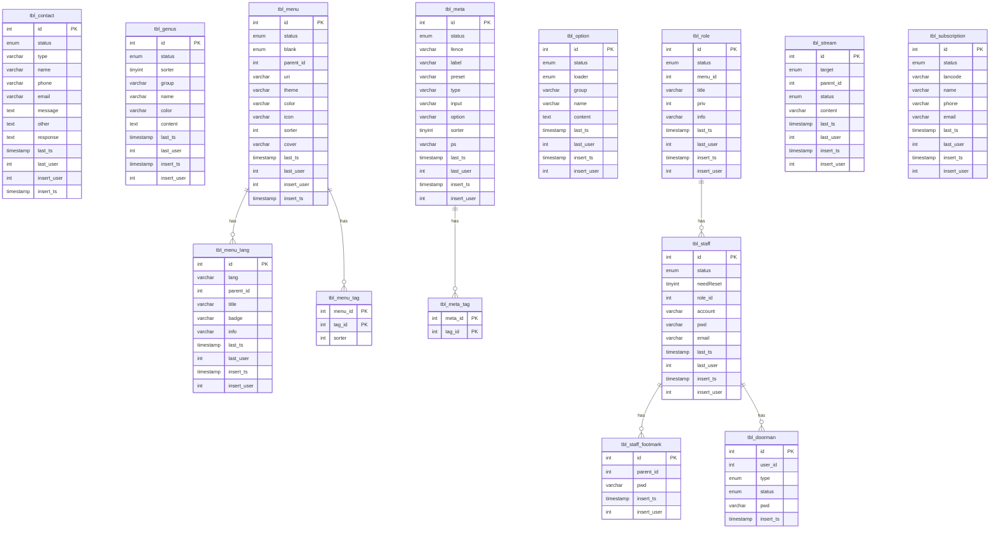

## F3CMS 簡介

> **命名與術語約定**：以下說明中的專有名詞均使用 F3CMS 內部既定命名（如 Feed/Outfit/Reaction）。若提及資料表，統一以 `tbl_` 前綴與小寫命名；多語系資料表以 `_lang` 結尾；多對多關聯以 `tbl_{entity_a}_{entity_b}` 表示。

F3CMS 系統是一個為現代 Web 應用程式設計的內容管理系統 (CMS)，其核心立意在於創建一個能夠應對當前軟體開發挑戰的 **高彈性、易於維護且可擴充** 的系統。它透過創新的 Hierarchical FORK 架構和完善的資料模型設計，旨在克服傳統 MVC (Model-View-Controller) 模型的限制，提供一個高效能、易於開發且良好支援多語系與複雜內容管理的框架。

以下將詳細說明 F3CMS 的各個面向：

### F3CMS 的設計立意與目的
F3CMS 的核心目標是為現代軟體開發提供一個優越的解決方案，其主要目的包括：
*   **避免傳統 MVC 模型的缺點**：F3CMS 採用全新的 Hierarchical FORK 架構設計，旨在解決傳統 MVC 模型在處理大型應用程式時，特別是在視圖 (View) 層面可能導致的 **「Spaghetti code」（義大利麵式程式碼）** 問題。
*   **提升系統模組化與可擴充性**：透過將系統劃分為清晰的層級結構和獨立的組件，F3CMS 旨在顯著提升模組化程度和擴展彈性。這種設計使得系統各部分能夠獨立開發和測試，未來在應對業務調整與 IT 技術升級時，可以根據需求調整或設計每一層，而無需重新打造整個主系統。
*   **優化大型應用程式處理**：Hierarchical FORK 架構重新定義了傳統系統架構，採用更為優雅且有序的組織方式來處理大型應用程式，從而提高系統的長期適應能力和維護便捷性。
*   **提供高效開發解決方案**：F3CMS 的架構整合了不同的框架和服務，旨在提供一個高效的開發解決方案。

### Hierarchical FORK 架構
F3CMS 採用其獨特的 **Hierarchical FORK 架構** 設計。此架構將系統劃分為以下核心組件，這些組件被封裝在層次結構中，每個單元由專屬組件構成，且單元之間可以互相嵌套，實現更細緻的邏輯分離和元件重用：

*   **資料提供 (Feed)**
    *   **職責**：負責實體的資料層操作，例如常見的 **新增、刪除、修改、查詢 (CRUD)** 等。
    *   **特性**：每個實體都配有專屬的 Feed 層，處理特定功能的數據管理和少量資料邏輯。
*   **頁面回饋 (Outfit)**
    *   **職責**：負責管理表現層，處理頁面呈現的 **商業邏輯**，並協調資料提供者 (Feed) 和視覺主題 (Theme) 之間的互動。
    *   **特性**：每個實體都有專屬的 Outfit，能夠獨立處理用戶的頁面請求。
*   **互動反應 (Reaction)**
    *   **職責**：專門負責處理 **AJAX 等互動式呼叫**，並以 **JSON 格式回應**。
    *   **特性**：配合使用異步技術或 WebSocket，有效提高用戶體驗和系統性能，使操作反應更快速、即時和流暢。
*   **工具箱 (Kit)**
    *   **職責**：透過 Kit 統一 **管理共用程式和功能模組**。
    *   **特性**：提供常用工具和功能支援，避免重複撰寫代碼，提高開發效率。
*   **視覺主題 (Theme)**
    *   **職責**：負責 **產出 HTML 碼** 供頁面回饋 (Outfit) 使用。
    *   **特性**：採用 **模板引擎** 將 HTML 獨立出來，以避免傳統 MVC 視圖 (View) 層可能產生的「Spaghetti code」問題，使系統架構更清晰、維護更方便。

#### Hierarchical FORK 架構的優勢
Hierarchical FORK 架構的主要優勢在於：
*   **降低耦合度**：其層次化的組織方式有助於減少各層之間的耦合度。
*   **提升可維護性與可測試性**：有助於提升系統的長期可維護性和可測試性。
*   **提高開發效率與系統效能**：資料提供 (Feed) 的獨立性和一致的資料架構，以及工具箱 (Kit) 的共用程式碼管理，能減少開發工作，提高整體開發效率和系統效能。
*   **強化動態處理能力**：結合互動反應 (Reaction) 組件，進一步強化了系統的動態處理能力，以滿足現代應用程式的即時互動需求。

### Hierarchical FORK 架構與傳統 MVC 模型的對比
Hierarchical FORK 是 F3CMS 針對傳統 MVC 模型在處理大型應用程式時可能出現的弊端（例如視圖層的「Spaghetti code」）所提出的一種 **改良型架構**。下表總結了兩者之間的關鍵差異：

| 特點 | 傳統 MVC 模型 | Hierarchical FORK 架構 |
| :------- | :------- | :------- |
| **設計目的** | 一種軟體設計模式，將應用程式劃分為模型、視圖、控制器，以分離關注點。 | 旨在 **避免傳統 MVC 模型的缺點**，提升模組化、易維護性和可擴充性。 |
| **結構** | 模型（資料與業務邏輯）、視圖（使用者介面）、控制器（處理輸入、更新模型和視圖）。 | 將系統劃分為 **資料提供 (Feed)、頁面回饋 (Outfit)、互動反應 (Reaction) 和工具箱 (Kit)** 等核心組件，並引入 **視覺主題 (Theme)**。 |
| **View 處理** | 視圖可能直接包含 HTML 和呈現邏輯，易產生 **「Spaghetti code」**。 | 引入 **視覺主題 (Theme)**，將 HTML 碼獨立出來，由 **模板引擎** 建構，避免 View 層的程式碼混亂。 |
| **互動處理** | 控制器通常負責處理使用者輸入和頁面導航。 | 引入 **互動反應 (Reaction)** 組件，專門處理 **AJAX 呼叫** 並以 JSON 格式回應，強化即時互動能力。 |
| **層次關係** | 模型、視圖、控制器之間的交互通常是較為扁平的。 | 採用 **清晰的層級結構**，組件之間可以互相嵌套，實現更細緻的邏輯分離。 |
| **優勢** | 分離關注點，提高程式碼組織。 | 降低各層之間的 **耦合度**，提升 **可維護性、可測試性、開發效率和系統效能**，並強化 **動態處理能力**。 |

### 資料模型與模組概述
F3CMS 的實體關係模型 (ERD) 清晰展示了多種已有的內容管理及系統功能模組，並具備強大的 **多語系支援能力**。其預設資料表結構以 WordPress 為基礎並經過強化，能更有效地區別存放不同屬性資料。

在簡化後的類別圖中，F3CMS 的資料模型設計理念整合了以下概念：
*   **本地化內容 (語言相關表)**：語言相關表 (如 `tbl_X_lang`) 儲存多種語言內容 (如標題、摘要、內容)，這些屬性被視為其父類別的 **本地化內容** 屬性集合。
*   **中繼資料 (中繼資料表)**：中繼資料表 (如 `tbl_X_meta`) 以鍵值對 (`k`, `v`) 形式儲存額外資訊，被歸納為父類別的 **中繼資料** 屬性 (可擴展的鍵值對集合)。
*   **關聯**：關聯表 (如 `tbl_X_Y`) 用於建立多對多關係，在類別圖中直接轉換為類別之間的 **關聯** (例如「擁有多個」或「關聯多個」)。
*   **時間戳記與使用者資訊**：每個類別通常包含 `last_ts` (最後更新時間), `last_user` (最後更新使用者), `insert_ts` (插入時間), `insert_user` (插入使用者) 等通用屬性，方便進行資料追蹤與審計。
*   **階層式資料管理**：`menu` 和 `tag` 等資料表透過 `parent_id` 欄位實現了 **遞迴關聯**，允許建立巢狀選單結構和階層式標籤，有助於更靈活地組織和管理內容。

F3CMS 涵蓋了以下核心內容管理及系統功能模組：

#### CMS 核心資料庫模組:
*   **Advertisement (廣告)**：管理廣告的狀態、權重、點擊/曝光次數、主題、URI、封面、背景以及起訖日期。支援多語言的標題、副標題和內容，以及額外的中繼資料。
*   **Author (作者)**：管理作者的狀態、縮略名、上線日期、排序和封面。支援多語言的標題、職稱、標語、摘要和內容，並可關聯多個 **Tag (標籤)**。
*   **Book (書籍)**：管理書籍的狀態、分類、點擊/曝光次數、URI 和封面。支援多語言的標題、副標題、別名、摘要和內容。
*   **Category (分類)**：管理內容分類的狀態、排序、群組、縮略名和封面。支援多語言的標題和資訊，並可關聯多個 **Tag (標籤)**。
*   **Dictionary (字典)**：管理字典條目的狀態、縮略名和封面。支援多語言的標題、別名和摘要.
*   **Media (媒體庫管理)**：管理媒體檔案 (如圖片 `pic`) 的目標、父ID、狀態、縮略名、標題、圖片和資訊。支援額外的中繼資料，並可關聯多個 **Tag (標籤)**。
*   **Post (文章/內容管理)**：管理固定單頁的狀態、縮略名、封面和版面。支援多語言的標題和內容 (可標註是否來自AI)，以及額外的中繼資料。可關聯多個 **Tag (標籤)**。
*   **Press (新聞稿/媒體報導管理)**：管理文章的分類、版面、狀態、模式、是否在首頁顯示、是否置頂、縮略名、上線日期、排序、封面和橫幅。支援多語言的標題、關鍵字、資訊和內容 (可標註是否來自AI)，以及額外的中繼資料。可關聯多個 **Author (作者)**、**Book (書籍)**、**Press (相關文章)** (自反關係)、**Tag (標籤)** 和 **Term (術語)**，並擁有多個 **PressTrace (文章追蹤記錄)**。
*   **PressTrace (文章追蹤記錄)**：記錄文章的追蹤資訊，包含文章ID。
*   **Search (搜尋)**：管理搜尋記錄的語系、狀態、網站ID、點擊次數、標題和資訊。可關聯多個 **Press (文章)**。
*   **Tag (標籤管理)**：管理標籤的分類、狀態、父ID、點擊次數和縮略名。支援多語言的標題、別名和資訊，並可關聯多個 **Tag (相關標籤)** (自反關係)。

#### 核心資料庫模組:
*   **Contact (聯絡表單管理)**：管理用戶提交的聯絡資訊，包括狀態、類型、姓名、電話、電子郵件、訊息、其他細節和回覆。
*   **Doorman (門衛)**：管理用戶的登入或權限憑證記錄，包括使用者ID、類型、狀態和密碼。與 **Staff (員工)** 關聯。
*   **Genus (類別)**：管理一般類別的狀態、排序、群組、名稱、顏色和內容。
*   **Menu (選單管理)**：管理網站選單的狀態、是否空白、父ID、URI、主題、顏色、圖示、排序和封面。支援多語言的標題、徽章和資訊，並可關聯多個 **Tag (標籤)**。透過 `parent_id` 實現巢狀選單結構。
*   **Meta (通用中繼資料定義)**：定義通用中繼資料的狀態、柵欄、標籤、預設值、類型、輸入類型、選項、排序和備註。可關聯多個 **Tag (標籤)**。
*   **Option (系統選項管理)**：管理系統配置與設定的狀態、載入器、群組、名稱和內容。
*   **Role (角色)**：管理系統角色的狀態、選單ID、標題、權限和資訊。一個角色可被多個 **Staff (員工)** 擁有。
*   **Staff (員工/用戶管理)**：管理系統員工帳戶的狀態、是否需要重設密碼、角色ID、帳號、密碼和電子郵件。屬於一個 **Role (角色)**，並擁有多個 **StaffFootmark (員工足跡/密碼歷史)** 和 **Doorman (門衛記錄)**。
*   **StaffFootmark (員工足跡/密碼歷史)**：記錄員工的密碼歷史，包含父ID (應為員工ID) 和密碼。
*   **Stream (串流)**：管理串流資訊的目標、父ID、狀態和內容。
*   **Subscription (訂閱)**：管理訂閱者的狀態、語系代碼、姓名、電話和電子郵件。

### F3CMS 的主要優點 (總結)
F3CMS 藉由其獨特的 Hierarchical FORK 架構設計和靈活的資料模型，帶來了以下多方面的優點：
*   **高度模組化與可擴充性**： Hierarchical FORK 架構將系統劃分為清晰的組件，並基於 Web 的多層式開發 (N-Tier 架構) 設計，實現高靈活性與擴展彈性，有助於降低資源消耗，同時大幅提升系統的負載能力與運作效率。
*   **提升可維護性與可測試性**： Hierarchical FORK 的層次化組織方式有效降低各層之間的耦合度，各組件職責明確，且視覺主題 (Theme) 分離 HTML 部分，採用模板引擎，避免了「Spaghetti code」，使程式碼更易於理解、維護和測試。
*   **提高開發效率與系統效能**：資料提供 (Feed) 的獨立性、工具箱 (Kit) 的共用程式碼管理以及互動反應 (Reaction) 組件對 AJAX 呼叫的強化處理，共同提升了開發效率和系統性能，提供快速、即時、流暢的操作反應。
*   **強大的內容管理與多語系支援**： F3CMS 具有高彈性的資料結構，支援各種資料表設計，並透過多個核心資料表的 `_lang` 對應表提供全面的 **多語系支援能力**。`parent_id` 欄位實現的階層式資料管理 (如選單和標籤)，以及詳細的資料追蹤欄位，都強化了內容管理的靈活性和可控性。

總而言之，F3CMS 的設計理念使其能夠提供一個高彈性、高效能、易於開發與維護，且良好支援多語系與複雜內容管理的現代化 Web 應用程式框架。

### ERD

#### CMS

```mermaid
erDiagram

    tbl_adv {
        int id PK
        int position_id
        int counter
        int exposure
        enum status
        int weight
        varchar theme
        timestamp start_date
        timestamp end_date
        varchar uri
        varchar cover
        varchar background
        timestamp last_ts
        int last_user
        int insert_user
        timestamp insert_ts
    }

    tbl_adv_lang {
        int id PK
        varchar lang
        int parent_id
        varchar title
        varchar subtitle
        text content
        timestamp last_ts
        int last_user
        timestamp insert_ts
        int insert_user
    }

    tbl_adv_meta {
        int id PK
        int parent_id
        timestamp last_ts
        varchar k
        text v
    }

    tbl_author {
        int id PK
        enum status
        varchar slug
        date online_date
        int sorter
        varchar cover
        timestamp last_ts
        int last_user
        timestamp insert_ts
        int insert_user
    }

    tbl_author_lang {
        int id PK
        varchar lang
        int parent_id
        varchar title
        varchar jobtitle
        varchar slogan
        varchar summary
        text content
        timestamp last_ts
        int last_user
        timestamp insert_ts
        int insert_user
    }

    tbl_author_tag {
        int author_id PK
        int tag_id PK
    }

    tbl_book {
        int id PK
        enum status
        int cate_id
        int counter
        int exposure
        varchar uri
        varchar cover
        timestamp last_ts
        int last_user
        timestamp insert_ts
        int insert_user
    }
    
    tbl_book_lang {
        int id PK
        varchar lang
        int parent_id
        varchar title
        varchar subtitle
        varchar alias
        text summary
        text content
        timestamp last_ts
        int last_user
        timestamp insert_ts
        int insert_user
    }

    tbl_category {
        int id PK
        enum status
        tinyint sorter
        varchar group
        varchar slug
        varchar cover
        timestamp last_ts
        int last_user
        timestamp insert_ts
        int insert_user
    }

    tbl_category_lang {
        int id PK
        varchar lang
        int parent_id
        varchar title
        varchar info
        timestamp last_ts
        int last_user
        timestamp insert_ts
        int insert_user
    }

    tbl_category_tag {
        int tag_id PK
        int category_id PK
        int sorter
    }

    tbl_dictionary {
        int id PK
        enum status
        varchar slug
        varchar cover
        timestamp last_ts
        int last_user
        timestamp insert_ts
        int insert_user
    }

    tbl_dictionary_lang {
        int id PK
        varchar lang
        int parent_id
        varchar title
        varchar alias
        text summary
        timestamp last_ts
        int last_user
        timestamp insert_ts
        int insert_user
    }

    tbl_media {
        int id PK
        enum target
        int parent_id
        enum status
        varchar slug
        varchar title
        varchar pic
        varchar info
        timestamp last_ts
        int last_user
        timestamp insert_ts
        int insert_user
    }

    tbl_media_meta {
        int id PK
        int parent_id
        timestamp last_ts
        varchar k
        text v
    }

    tbl_media_tag {
        int media_id PK
        int tag_id PK
    }

    tbl_post {
        int id PK
        enum status
        varchar slug
        varchar cover
        varchar layout
        timestamp last_ts
        int last_user
        timestamp insert_ts
        int insert_user
    }

    tbl_post_lang {
        int id PK
        enum from_ai
        varchar lang
        int parent_id
        varchar title
        text content
        timestamp last_ts
        int last_user
        timestamp insert_ts
        int insert_user
    }

    tbl_post_meta {
        int id PK
        int parent_id
        timestamp last_ts
        varchar k
        text v
    }

    tbl_post_tag {
        int post_id PK
        int tag_id PK
    }

    tbl_press {
        int id PK
        int cate_id
        int layout
        enum status
        enum mode
        enum on_homepage
        enum on_top
        varchar slug
        datetime online_date
        int sorter
        varchar cover
        varchar banner
        timestamp last_ts
        int last_user
        timestamp insert_ts
        int insert_user
    }

    tbl_press_author {
        int press_id PK
        int author_id PK
        int sorter
    }

    tbl_press_book {
        int press_id PK
        int book_id PK
        int sorter
    }

    tbl_press_lang {
        int id PK
        enum from_ai
        varchar lang
        int parent_id
        varchar title
        varchar keyword
        varchar info
        text content
        timestamp last_ts
        int last_user
        timestamp insert_ts
        int insert_user
    }

    tbl_press_meta {
        int id PK
        int parent_id
        timestamp last_ts
        varchar k
        text v
    }

    tbl_press_related {
        int press_id PK
        int related_id PK
        int sorter
    }

    tbl_press_tag {
        int press_id PK
        int tag_id PK
    }

    tbl_press_term {
        int press_id PK
        int term_id PK
        int sorter
    }

    tbl_press_trace {
        int id PK
        int press_id
        timestamp last_ts
        timestamp insert_ts
        int insert_user
    }

    tbl_search {
        int id PK
        varchar lang
        enum status
        int site_id
        int counter
        varchar title
        varchar info
        timestamp last_ts
        int last_user
        timestamp insert_ts
        int insert_user
    }

    tbl_search_press {
        int press_id PK
        int search_id PK
    }

    tbl_tag {
        int id PK
        int cate_id
        enum status
        int parent_id
        int counter
        varchar slug
        timestamp last_ts
        int last_user
        timestamp insert_ts
        int insert_user
    }

    tbl_tag_lang {
        int id PK
        varchar lang
        int parent_id
        varchar title
        varchar alias
        varchar info
        timestamp last_ts
        int last_user
        timestamp insert_ts
        int insert_user
    }

    tbl_tag_related {
        int related_id
        int tag_id
        int sorter
    }

    %% Relationships
    tbl_adv ||--o{ tbl_adv_lang : "has"
    tbl_adv ||--o{ tbl_adv_meta : "has"
    tbl_author ||--o{ tbl_author_lang : "has"
    tbl_author ||--o{ tbl_author_tag : "has"
    tbl_category ||--o{ tbl_category_lang : "has"
    tbl_category ||--o{ tbl_category_tag : "has"
    tbl_book ||--o{ tbl_book_lang : "has"
    tbl_dictionary ||--o{ tbl_dictionary_lang : "has"
    tbl_media ||--o{ tbl_media_meta : "has"
    tbl_media ||--o{ tbl_media_tag : "has"
    tbl_post ||--o{ tbl_post_lang : "has"
    tbl_post ||--o{ tbl_post_meta : "has"
    tbl_post ||--o{ tbl_post_tag : "has"
    tbl_press ||--o{ tbl_press_author : "has"
    tbl_press ||--o{ tbl_press_book : "has"
    tbl_press ||--o{ tbl_press_lang : "has"
    tbl_press ||--o{ tbl_press_meta : "has"
    tbl_press ||--o{ tbl_press_related : "has"
    tbl_press ||--o{ tbl_press_tag : "has"
    tbl_press ||--o{ tbl_press_term : "has"
    tbl_press ||--o{ tbl_press_trace : "has"
    tbl_search ||--o{ tbl_search_press : "has"
    tbl_tag ||--o{ tbl_tag_lang : "has"
    tbl_tag ||--o{ tbl_tag_related : "has"
```

#### 核心

