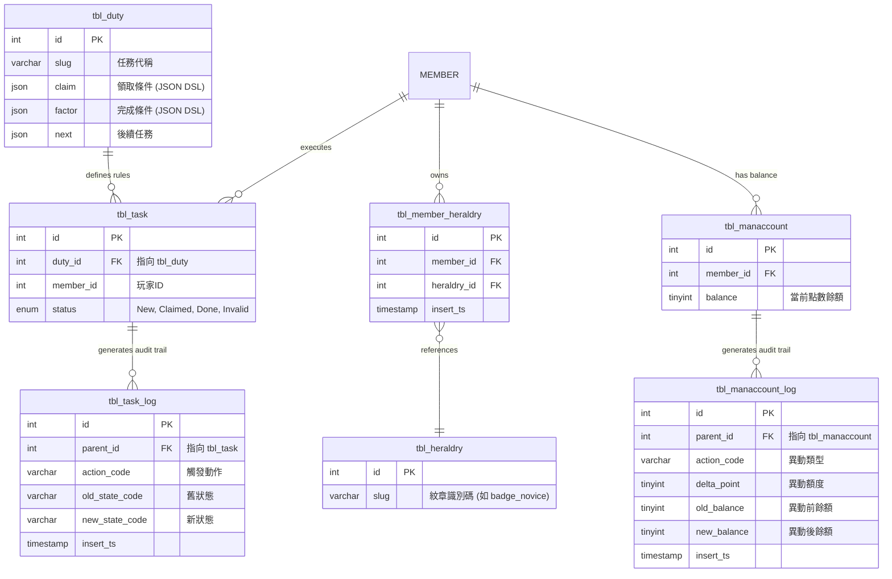
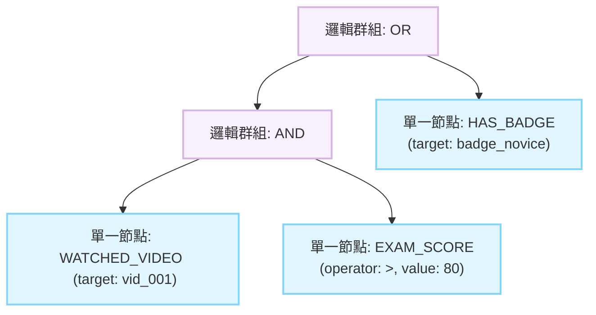

# Event Rule Engine - idea.md (v3)

這是一份由資深系統分析師 (Senior Systems Analyst) 視角出發，結合 FDD (文件驅動開發) 規範，並已正式整合「JSON Payload API 合約」與「三項核心 Schema 修正」的終極版規格基準。本文件將確保 Business (企劃端) 的多層次邏輯需求，能精準對接到 IT (開發與 DBA 端) 的架構設計。

### 1. 背景與問題定義 (Problem Statement)
在處理任務解鎖、成就達成與事件觸發時，系統面臨企劃端頻繁新增或組合驗證條件的需求。傳統的關聯式資料庫在應付高度嵌套的邏輯時，常需不斷執行 `ALTER TABLE` 新增欄位，或建立極其複雜的多對多關聯表，導致 Schema 維護成本過高。此外，過度依賴關聯查詢，在驗證規則時極易引發效能瓶頸。

### 2. 目標結果 (Target Outcome)
導入一套基於 JSON DSL (領域特定語言) 的 Event Rule Engine。系統將透過標準化的抽象語法樹 (AST) 結構儲存規則，並在後端運用組合模式 (Composite Pattern) 進行遞迴解析與短路求值 (Short-circuit Evaluation)。這將使我們能以單一 JSON 欄位取代複雜的任務條件表，免除未來因新增規則而異動 Schema 的技術債，並同時支援前端可視化編輯器的無縫對接。

### 3. 範圍 (Scope)
*   **JSON DSL 結構化儲存**：將多層次巢狀條件 (如 AND、OR 及 >, <, ==) 序列化，並存入關聯式資料庫的原生 JSON 欄位中。
*   **開閉原則 (OCP) 規則引擎**：實作策略模式與組合模式，未來新增條件 (如「加入公會」) 僅需註冊新的 `Evaluator`，不需修改核心引擎。
*   **無狀態資料提供者 (PlayerContext)**：作為 CQRS 讀取模型，於 Request 階段預載快取，餵給引擎驗證。
*   **Schema 架構修正落地**：正式套用 JSON 型態欄位擴充、補齊 Module-owned Log (含新舊狀態追蹤)，以及建立明確的多對多關聯表 (如 `tbl_member_heraldry`)。

### 4. 非範圍 (Non-Scope)
*   **前端可視化編輯器 (Visual Node Editor)**：第一版專注於後端引擎與資料層的儲存對接，暫不包含前端拖拉式藍圖編輯器的實作。
*   **動態寫入與全域即時反查 API**：第一版暫不實作供企劃端使用的複雜條件全域反查 (如查出所有「需加入公會」的任務)，如有需求將另行規劃 GIN 索引。

### 5. 核心物件與流程 (Core Objects or Processes)
*   **PlayerContext (資料提供者)**：負責從 Redis 或 DB 極速獲取玩家當前狀態與關聯資料 (如持有的紋章 ID 陣列)。
*   **RuleEngine (遞迴引擎)**：負責遍歷 JSON AST 樹，並依據邏輯閘進行短路求值彙總結果。
*   **Evaluators (策略實作)**：針對獨立的類型 (如 `EXAM_SCORE`, `HAS_BADGE`) 進行具體驗證邏輯。

### 6. 角色與參與者 (Actors and Roles)
*   **企劃人員 (Planners)**：定義 JSON AST 結構，靈活組合任務與事件的解鎖條件。
*   **系統層 (System Context)**：觸發任務檢查，將玩家的 Context 傳遞給 Rule Engine 進行無狀態運算。

### 7. 資料與狀態影響 (Data and State Implications - 含 Schema 修正與 ERD)
為確保高併發防禦力與 F3CMS 架構合規性，我們已套用三項核心 Schema 修正，以下為修正後的資料模型設計：

1.  **JSON AST Payload 空間擴充**：`tbl_duty` 中的 `claim` 與 `factor` 欄位已從 `varchar` 修正為 JSON 型態語意承接 DSL payload；在本專案第一版 DB 基線上，實際需以 MariaDB 10.4.6 相容行為落地，不預設依賴 PostgreSQL `JSONB` 能力，並以 application-side validator 確保 payload 正確性。
2.  **多對多關聯表補齊 (Relation Table)**：為支援 Rule Engine 驗證如 `HAS_BADGE` 這類的狀態，已新增 `tbl_member_heraldry`，嚴格遵守實體關聯原則，拒絕將關聯邏輯塞入玩家主表的 JSON 中。
3.  **Module-owned Log 完整狀態追蹤**：依據 F3CMS 的 Module-owned Workflow Log 規範，`tbl_task_log` 與 `tbl_manaccount_log` 應採 `parent_id` 指回主表，並補齊 `action_code`、`old_state_code` / `new_state_code` 或 `old_balance` / `new_balance`，確保事件驅動下的稽核軌跡 (Audit Trail) 完整不漏。



### 8. 限制與依賴 (Constraints and Dependencies)
*   **資料庫層級 (DB Level)**：第一版必須以專案既有的 MariaDB 10.4.6 相容行為為準，使用 JSON 型態語意承接 payload，但不預設可使用 PostgreSQL `JSONB`、GIN 或其他 PostgreSQL 專屬能力。所有針對餘額 (`tbl_manaccount.balance`) 或狀態 (`tbl_task.status`) 的更新必須包裝在具備原子性 (Atomic) 或樂觀鎖的 Transaction 內。
*   **快取層級 (Cache Level)**：強烈依賴 Redis 進行 `PlayerContext` 的預載入 (Pipeline/MGET)，確保在驗證規則時能徹底消滅 N+1 查詢，實現無狀態的高效能運算。

### 9. 風險與未決問題 (Risks and Open Questions)
*   **遞迴深度與記憶體耗盡 (OOM Risk)**：企劃若設定過度深層的 JSON 結構，可能導致伺服器解析時記憶體溢出。防禦決策：在 API 寫入 `tbl_duty` 時必須配置 Payload Validator，強制限制 JSON 抽象語法樹的最大深度 (如 max_depth = 5)。
*   **未來的全域反查需求**：若後續需要頻繁從 `tbl_duty` 中撈取包含特定條件 (如 `HAS_BADGE`) 的任務，第一版會面臨 JSON payload 反查效率不足的風險。防禦決策：視營運需求，後續再評估 generated column、專用索引欄位或額外 index table，而不是在第一版預設支援全域 AST 反查。

### 10. 早期範例或情境 (Early Examples or Scenarios)
**業務情境 (Business Scenario)**：
「(需看完指定影片 且 測驗分數 > 80分) 或 (擁有初級紋章)」。

**AST 抽象語法樹結構 (Abstract Syntax Tree - Mermaid Visualization)**：
此架構確保了後端能運用組合模式遞迴計算，前端也能對接藍圖節點編輯器。


**JSON DSL 規格合約 (JSON Payload Contract)**：
這是 API 與 `tbl_duty.claim` 欄位中儲存的唯一真理 (Single Source of Truth)。
```json
{
  "operator": "OR",
  "rules": [
    {
      "operator": "AND",
      "rules": [
        {
          "type": "WATCHED_VIDEO",
          "target": "vid_001"
        },
        {
          "type": "EXAM_SCORE",
          "operator": ">",
          "value": 80
        }
      ]
    },
    {
      "type": "HAS_BADGE",
      "target": "badge_novice"
    }
  ]
}
```

**運算與防禦優勢**：在驗證此結構時，引擎會利用短路求值特性。若 `AND` 節點內的第一個條件 `WATCHED_VIDEO` 為 false，引擎將立即跳出不執行後續的 `EXAM_SCORE` 計算，極大化 CPU 的運算效益。
