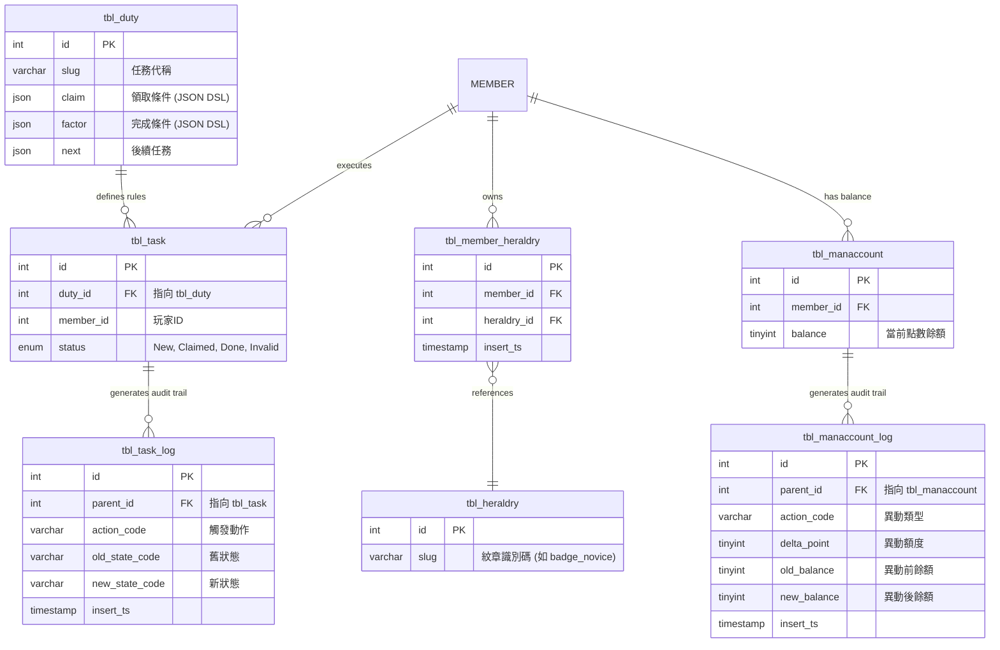
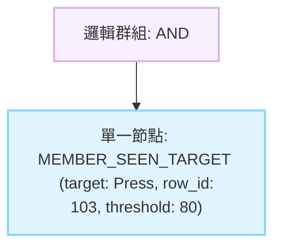

# Event Rule Engine - idea.md (v3)

這是一份由資深系統分析師 (Senior Systems Analyst) 視角出發，結合 FDD (文件驅動開發) 規範，並已正式整合「JSON Payload API 合約」與「三項核心 Schema 修正」的終極版規格基準。本文件將確保 Business (企劃端) 的多層次邏輯需求，能精準對接到 IT (開發與 DBA 端) 的架構設計。

### 1. 背景與問題定義 (Problem Statement)
在處理任務解鎖、成就達成與事件觸發時，系統面臨企劃端頻繁新增或組合驗證條件的需求。傳統的關聯式資料庫在應付高度嵌套的邏輯時，常需不斷執行 `ALTER TABLE` 新增欄位，或建立極其複雜的多對多關聯表，導致 Schema 維護成本過高。此外，過度依賴關聯查詢，在驗證規則時極易引發效能瓶頸。

### 2. 目標結果 (Target Outcome)
導入一套基於 JSON DSL (領域特定語言) 的 Event Rule Engine，但第一個 production scenario 不再是抽象的 `WATCHED_VIDEO` / `EXAM_SCORE` 原型，而是明確承接實際業務路徑：當會員觸發 `Member::Register` 時，系統需找出所有對應 trigger 的 duty，依 duty payload 建立 task；之後當會員在文章頁面捲動達 80% 時，由 `rPress` 接收事件並委派 `fMember` 寫入通用 `member_seen` 紀錄；最後再由 duty 內預先定義的 task contract 決定任務是否可標記為 `Done`，並在同一個 transaction 中完成 task 狀態更新與 100 點獎勵入帳。

### 3. 範圍 (Scope)
*   **Duty JSON Payload Contract**：明確定義 duty payload 如何表達 `Member::Register` trigger 與 task 建立模板，而不是把 trigger 與條件硬寫在 reaction 或 service 內。
*   **Duty 內的 Task Contract**：明確定義 duty payload 如何同時表達 task_template、完成條件與 reward contract；task done 判斷與獎勵入帳應回讀 duty contract，而不是把 JSON 複製進 `tbl_task`。
*   **Member Seen 通用事件來源**：建立 `member_seen` 類型的通用觀看紀錄模型，以 `target + row_id` 區分文章、影片與其他內容；語意是「第一次達標就永遠成立」。
*   **Module-first 業務落地**：凡是牽涉 `tbl_duty`、`tbl_task`、`tbl_task_log`、`tbl_member_seen`、`tbl_manaccount`、`tbl_manaccount_log` 等實體資料表的讀取、整合、狀態寫回與 audit trail，都必須落在各自 owning module 的 reaction / service / kit 邊界，而不是被抽成單一 `EventRuleEngine` module，也不是塞進 `libs`。
*   **rPress 事件入口 + fMember 寫入邊界**：文章頁 80% 事件可由 `rPress` 接收，但真正寫入 `member_seen` 的動作必須落在 `fMember`，以符合 member-owned event record 邊界。
*   **Schema 架構修正落地**：除了既有 baseline 外，需再補 `member_seen`，並明確維持 task contract 留在 `tbl_duty` JSON，而不是擴張 `tbl_task` 為額外 JSON 載體，讓 `Press seen -> task done -> point reward` 這條第一個 production scenario 可被完整承接。

### 4. 非範圍 (Non-Scope)
*   **前端可視化編輯器 (Visual Node Editor)**：第一版專注於後端引擎與資料層的儲存對接，暫不包含前端拖拉式藍圖編輯器的實作。
*   **動態寫入與全域即時反查 API**：第一版暫不實作供企劃端使用的複雜條件全域反查 (如查出所有「需加入公會」的任務)，如有需求將另行規劃 GIN 索引。
*   **把多個 owning module 的業務資料錯收斂成單一 EventRuleEngine module**：`duty`、`task`、`member`、`manaccount` 仍各自歸屬既有 module；第一版不建立一個新的 table-owning `EventRuleEngine` module 去接手這些資料。
*   **將 table-backed 業務邏輯長期留在 `libs`**：`libs` 可保留 shared 的 JSON parser、validator、AST traversal、registry 與 pure evaluator runtime；但凡是依賴實體資料表、payload 真實載入、PlayerContext preload、module integration 或狀態寫回的內容，都不屬於 `libs` 的長期責任。
*   **把 `press_id = 103` 這類 business 條件硬寫進程式**：所有具體目標內容與 reward 數值都應存在 duty payload contract，而不是散落在 reaction、feed 或 smoke 中。

### 5. 核心物件與流程 (Core Objects or Processes)
*   **RuleParser / Validator / RuleEngine (shared engine)**：作為 `libs` 中可長期保留的共用元件，負責將原始 JSON / array 正規化為 AST、做 payload 防禦、遍歷規則樹並進行短路求值；它們不負責資料表讀取或狀態寫回。
*   **Duty Claim Contract**：由 duty payload 描述 trigger 與 task_template；當 `trigger = Member::Register` 時，由上層流程根據 duty claim 建立對應 task。
*   **Task Contract in Duty**：duty 建立 task 時，`factor` 與 `reward` 等任務契約仍留在 duty payload，例如 `claim.task_template` 或等價結構；後續 task done 判斷與點數寫回應回讀 duty contract，而不是在 `tbl_task` 存放額外 JSON。
*   **member_seen (Member-owned current truth)**：記錄會員首次達標的觀看事件，使用 `target + row_id` 表示看到哪個內容；一旦首次達標成立，後續同 target / row_id 不再重複覆蓋首次時間。
*   **PlayerContext (資料提供者 contract)**：engine 吃的是已預載完成的 context payload；對本輪具體情境而言，至少要能提供 `member_seen` 判斷結果、帳戶狀態與 duty contract 判斷所需欄位。
*   **Evaluators (shared pure strategies)**：第一個 production scenario 需要有能讀 `member_seen` 語意的 evaluator，例如 `MEMBER_SEEN_TARGET`；未來新增其他條件時仍應以註冊新 evaluator 為主，不回頭修改核心引擎。

### 6. 角色與參與者 (Actors and Roles)
*   **企劃人員 (Planners)**：定義 JSON AST 結構，靈活組合任務與事件的解鎖條件。
*   **系統層 (System Context)**：觸發任務檢查，將玩家的 Context 傳遞給 Rule Engine 進行無狀態運算。

### 7. 資料與狀態影響 (Data and State Implications - 含 Schema 修正與 ERD)
為確保高併發防禦力與 F3CMS 架構合規性，我們已套用三項核心 Schema 修正，以下為修正後的資料模型設計：

1.  **JSON AST Payload 空間擴充**：`tbl_duty` 中的 `claim` 與 `factor` 欄位已從 `varchar` 修正為 JSON 型態語意承接 DSL payload；在本專案第一版 DB 基線上，實際需以 MariaDB 10.4.6 相容行為落地，不預設依賴 PostgreSQL `JSONB` 能力，並以 application-side validator 確保 payload 正確性。
2.  **多對多關聯表補齊 (Relation Table)**：為支援 Rule Engine 驗證如 `HAS_BADGE` 這類的狀態，已新增 `tbl_member_heraldry`，嚴格遵守實體關聯原則，拒絕將關聯邏輯塞入玩家主表的 JSON 中。
3.  **Module-owned Log 完整狀態追蹤**：依據 F3CMS 的 Module-owned Workflow Log 規範，`tbl_task_log` 與 `tbl_manaccount_log` 應採 `parent_id` 指回主表，並補齊 `action_code`、`old_state_code` / `new_state_code` 或 `old_balance` / `new_balance`，確保事件驅動下的稽核軌跡 (Audit Trail) 完整不漏。
4.  **Member Seen 通用事件表**：為支援 `Press seen 80%` 這類 first-hit 永久成立的條件，需新增 `tbl_member_seen` 或等價實體，以 `member_id + target + row_id` 表達第一次達標時間與必要附帶欄位，拒絕把 seen truth 混回 `tbl_press_log` 或前端 cache。
5.  **Task 主表維持輕量化**：task done 所需的 `factor` 與 `reward` contract 應維持在 `tbl_duty` 的 JSON payload 內，由 `tbl_task.duty_id` 回指定義來源；第一版不在 `tbl_task` 增加 JSON 欄位，避免 task 主表混入非數字 payload 而影響主流程查詢與效能。



### 8. 限制與依賴 (Constraints and Dependencies)
*   **資料庫層級 (DB Level)**：第一版必須以專案既有的 MariaDB 10.4.6 相容行為為準，使用 JSON 型態語意承接 payload，但不預設可使用 PostgreSQL `JSONB`、GIN 或其他 PostgreSQL 專屬能力。所有針對餘額 (`tbl_manaccount.balance`) 或狀態 (`tbl_task.status`) 的更新必須包裝在具備原子性 (Atomic) 或樂觀鎖的 Transaction 內。
*   **快取層級 (Cache Level)**：強烈依賴 Redis 進行 `PlayerContext` 的預載入 (Pipeline/MGET)，確保在驗證規則時能徹底消滅 N+1 查詢，實現無狀態的高效能運算。
*   **F3CMS 架構層級 (Architecture Level)**：只要需求牽涉實體資料表，業務落地就必須以 module 為主；`libs` 僅能保留不依賴 table、cache、reaction 與 workflow side effect 的最小純 parser 元件。

### 9. 風險與未決問題 (Risks and Open Questions)
*   **遞迴深度與記憶體耗盡 (OOM Risk)**：企劃若設定過度深層的 JSON 結構，可能導致伺服器解析時記憶體溢出。防禦決策：在 API 寫入 `tbl_duty` 時必須配置 Payload Validator，強制限制 JSON 抽象語法樹的最大深度 (如 max_depth = 5)。
*   **未來的全域反查需求**：若後續需要頻繁從 `tbl_duty` 中撈取包含特定條件 (如 `HAS_BADGE`) 的任務，第一版會面臨 JSON payload 反查效率不足的風險。防禦決策：視營運需求，後續再評估 generated column、專用索引欄位或額外 index table，而不是在第一版預設支援全域 AST 反查。

### 10. 早期範例或情境 (Early Examples or Scenarios)
**目前第一個具體 production scenario**：
「當會員註冊後，系統找出所有 `Member::Register` trigger 的 duty 並建立 task；若該會員之後曾看過 `Press id = 103`，即可得到 100 分並將該 task 標註為 `Done`。」

**Duty JSON Payload Contract 範例**：
```json
{
  "trigger": "Member::Register",
  "task_template": {
    "slug": "press-103-seen-reward",
    "title": "看過文章 103 可得 100 分",
    "factor": {
      "operator": "AND",
      "rules": [
        {
          "type": "MEMBER_SEEN_TARGET",
          "target": "Press",
          "row_id": 103,
          "threshold": 80
        }
      ]
    },
    "reward": {
      "type": "POINT",
      "amount": 100,
      "action_code": "TASK_DONE_REWARD"
    }
  }
}
```

**Duty 內 task_template Contract 補充說明**：
上面的 `task_template.factor` 與 `task_template.reward` 已是 task done 所需的完整 contract。`tbl_task` 只需保留 `duty_id`、`member_id`、`status` 等主流程欄位，當 task 需要判斷是否完成時，再透過 `duty_id` 回讀 duty payload，而不是另外在 task 主表複製一份 JSON。

**第二個測試標準（保留舊 generic 範例）**：
除了上述 Press seen concrete scenario 外，原本的 generic AST 範例仍需保留，作為第二個測試標準，用來驗證 shared engine 仍能處理巢狀 `WATCHED_VIDEO` / `EXAM_SCORE` / `HAS_BADGE` 規則，而不是只剩單一路徑。

```json
{
  "operator": "OR",
  "rules": [
    {
      "operator": "AND",
      "rules": [
        {
          "type": "WATCHED_VIDEO",
          "target": "vid_001"
        },
        {
          "type": "EXAM_SCORE",
          "operator": ">",
          "value": 80
        }
      ]
    },
    {
      "type": "HAS_BADGE",
      "target": "badge_novice"
    }
  ]
}
```

**Seen 事件入口語意**：
- 前端在文章頁捲動達 80% 時，呼叫 `rPress` 的 seen endpoint
- `rPress` 只負責驗證 member 已登入、press 存在且 status 合法，再委派 `fMember` 寫入 `member_seen`
- `member_seen` 的語意是「第一次達標就永遠成立」，所以同 `member_id + target + row_id` 只保留首次達標時間

**AST 抽象語法樹結構 (Abstract Syntax Tree - Mermaid Visualization)**：
此結構確保後端能以純 evaluator 驗證「member 是否曾看過某個 target」，而不是在 engine 內直接查 press。


**運算與防禦優勢**：在驗證此結構時，引擎只需判斷 `member_seen` 是否已有對應 truth，不需在 evaluator 內直接查 `tbl_press_log`、不需重新推算瀏覽百分比，也不需相信前端每次重送的 80% 訊號。第一次達標後，後續任務檢查只讀 member-owned truth 即可。
