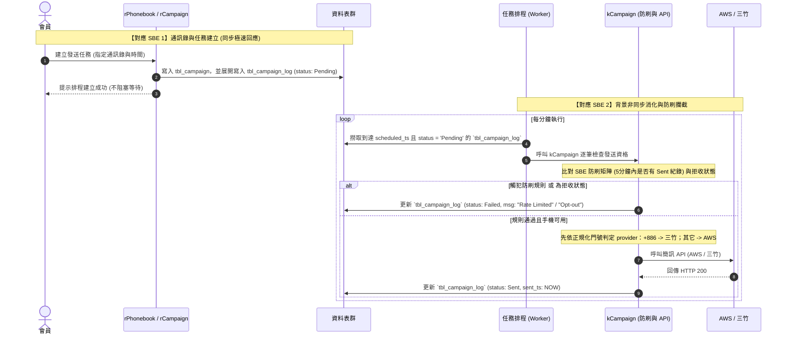

# 簡訊發送系統 (SMS Module)

### 1. 背景與問題定義 (Problem Statement)

在現代化網站營運中，系統需頻繁透過手機簡訊與使用者互動。除了單筆驗證外，平台會員亦有建立通訊錄進行批次發送的業務需求（單次最高 5000 筆）。 傳統同步發送不僅會造成系統 Timeout，且若缺乏正規化的資料結構，將無法實作「全域黑名單 (拒收機制)」與「5 分鐘防刷機制」。因此，我們需要一套具備佇列緩衝、雙供應商備援，且底層資料高度正規化的非同步通訊發送系統。

### 2. 目標結果 (Target Outcome)

建置一套「非同步簡訊發送模組」。系統提供會員建立「通訊錄 (Phonebook)」的介面，透過正規化資料表儲存名單與手機門號 (Mobile)。使用者建立「發送活動 (Campaign)」後，系統將活動展開為佇列日誌 (CampaignLog) 並極速回傳成功。背景排程依序消化佇列，依門號 routing rule 決定發送供應商：`+886` 門號固定走三竹，其它國碼固定走 AWS；並強制執行防刷與拒收攔截，確保營運成本與系統效能的安全。

### 3. 範圍 (Scope)

- **雙供應商策略 (Provider Strategy)**：實作 AWS SNS 與三竹簡訊邏輯，並以門號 routing rule 決定供應商：`+886` 走三竹，其它走 AWS。
- **高度正規化名單管理**：實作獨立的手機主檔 (`Mobile`) 與通訊錄主檔 (`Phonebook`)，支援全域異常/拒收狀態控管。
- **批次排程 (Batch & Schedule)**：支援單次 5000 筆通訊錄綁定發送，允許指定「排程時間」。
- **非同步背景佇列與防刷 (Queue & Rate Limit)**：由 Cronjob 背景消化佇列，並執行「同門號 5 分鐘限發 1 次」的業務防護。

### 4. 非範圍 (Non-Scope)

- **行銷超大群發**：單次批次上限為 5000 筆，不支援十萬筆以上的行銷電子報等級系統。
- **自動智慧重試 (Smart Retry)**：API 若回傳 500 錯誤，僅標示失敗並記錄原因，暫不實作自動重試。

### 5. 核心物件與模組邊界 (Core Objects & Module Boundaries)

依據 F3CMS 的架構規範，拆分為三個核心實體；為避免與 repo 內既有 generic `Task` domain 衝突，發送任務 owner 改採 `Campaign` 命名：

1. **`Mobile` (手機門號模組)**：管理全域手機號碼與狀態 (可用/拒收)。
2. **`Phonebook` (通訊錄模組)**：管理目標發送群組，與 `Mobile` 為 M:N 關聯。
3. **`Campaign` (發送任務模組)**：管理發送合約，並將目標展開為專屬附屬日誌佇列 (`CampaignLog`)。工具層 (`kCampaign`) 負責 API 呼叫與防刷邏輯。

### 6. 角色與參與者 (Actors and Roles)

- **平台會員 (Member)**：建立通訊錄、發起發送任務。
- **系統排程 (Queue Worker)**：背景非同步執行者，嚴格把關防刷機制。

### 7. 資料與狀態影響 (Data and State Implications)

核心 5 張資料表結構：

- `tbl_mobile`：主鍵 `id`, `phone_number` (UK), `status` (Active, Invalid, Opt-out)。
- `tbl_phonebook`：主鍵 `id`, `member_id`, `remark`。
- `tbl_phonebook_mobile`：關聯表 (M:N)。
- `tbl_campaign`：主鍵 `id`, `member_id`, `phonebook_id`, `content`, `scheduled_ts`。
- `tbl_campaign_log`：任務日誌與佇列表，含 `status` (Pending/Sent/Failed), `error_message`, `sent_ts`。

### 8. 限制與依賴 (Constraints and Dependencies)

- **效能要求**：`tbl_mobile` 需具備合適 Index 以應對 5000 筆的 `INSERT IGNORE` (Upsert) 效能。
- **排程依賴**：發送即時性受限於 Cronjob 執行頻率 (如每分鐘 1 次)。
- **供應商 routing 依賴**：worker 執行前必須先完成門號正規化；provider 選擇依正規化後的 E.164 國碼判定，`+886` 固定走三竹，其它固定走 AWS。

### 9. 風險與未決問題 (Risks and Open Questions)

- [已決議] 供應商為三竹與 AWS；單次上限 5000 筆。
- [已決議] provider routing rule 為：正規化後 `+886` 門號走三竹，其它國碼門號走 AWS。
- [已決議] 防刷機制為同一門號 5 分鐘內限發 1 次。
- [已決議] 採背景防刷體驗：允許前端極速上傳，由 Worker 攔截防刷並記錄。

---

### 10. 實例化規格與架構流轉 (Specification by Example & Scenarios)

為了消弭開發過程中的歧義，我們採用 **實例化規格 (SBE)** 的聲明式語法 (Declarative Language) 來定義業務規則。這剝離了瑣碎的 UI 點擊細節，專注於資料輸入與預期輸出的邊界條件。

#### 10.1 業務邏輯實例 (SBE Scenarios)

**功能 (Feature): 全域黑名單 (拒收) 過濾機制** _說明：確保使用者不管在哪份通訊錄中加入已被標記為「拒收」的門號，系統在發送時都會自動將其排除，節省營運成本。_

- **Given (假設)** 系統的 `tbl_mobile` 中，門號 "0900-000-000" 的狀態為 `Opt-out` (拒收)
- **When (當)** 會員建立了一個包含 "0900-000-000" 與 "0911-111-111" 的通訊錄，並對此通訊錄發起「發送任務」
- **Then (那麼)** 背景排程在處理佇列時，"0911-111-111" 將正常發送
- **And (並且)** "0900-000-000" 將被攔截，其在 `tbl_campaign_log` 的狀態應標記為 `Failed`，並註記 "Opt-out Number"

**功能 (Feature): 背景排程的 5 分鐘防刷機制 (Rate Limiting)** _說明：為防止惡意刷簡訊，同一門號在 5 分鐘內只能成功發送一次。此規則使用場景大綱與資料表 (Scenario Outline & Examples) 進行抽象化驗證。_

**場景大綱 (Scenario Outline): 依據前次發送時間判定是否阻擋發送**

- **Given (假設)** 系統背景排程 (Queue Worker) 啟動，準備處理一筆狀態為 `Pending` 的任務記錄
- **When (當)** 系統比對目標門號 `<Mobile Number>` 距離上一次的 `Sent` 記錄經過了 `<Time Elapsed>`
- **Then (那麼)** 此筆任務的發送行為應遵循 `<Expected Action>`，且 `tbl_campaign_log` 的最終狀態應為 `<Log Status>` 與 `<Error Message>`

**Examples (實例資料表):**

|Mobile Number|Time Elapsed (距離上次發送)|Expected Action (預期系統行為)|Log Status|Error Message|
|:--|:--|:--|:--|:--|
|0922-222-222|2 分鐘 (Under 5 mins)|**錯誤處理 / 防刷攔截**：不呼叫外部 API|`Failed`|"Rate Limited (5 mins)"|
|0933-333-333|6 分鐘 (Over 5 mins)|**Happy Path / 允許發送**：正常呼叫外部 API|`Sent`|`null`|
|0944-444-444|無 (從未發送過)|**Happy Path / 允許發送**：正常呼叫外部 API|`Sent`|`null`|

**功能 (Feature): 會員取得自己的通訊錄與發送活動清單** _說明：會員登入後，前端需要先取得自己既有的 `Phonebook` / `Campaign` 清單，再決定是沿用既有資料還是建立新的發送流程。這兩支清單 API 都應只看目前會員 session，不允許前端自行指定其它會員的 `member_id`。_

**場景大綱 (Scenario Outline): 會員取得自己的清單資料**

- **Given (假設)** 會員已登入，系統可從 session 取得目前會員 `member_id`
- **And (並且)** 系統內已存在 `<Resource Type>` 的資料，且其中有 `<Owned Count>` 筆屬於目前會員
- **When (當)** 前端呼叫 `<Route>` 取得清單
- **Then (那麼)** API 應回傳成功，且只回傳目前會員自己的資料
- **And (並且)** 回傳結構應包含 `subset`、`total`、`limit`、`page`
- **And (並且)** `subset` 中每筆資料的 `member_id` 都必須等於目前 session 的會員

**Examples (實例資料表):**

|Resource Type|Route|Owned Count|Expected Subset Example|
|:--|:--|:--|:--|
|Phonebook|`/api/phonebook/mine`|2|`[{id: 101, member_id: 123, title: "母親節名單"}, {id: 102, member_id: 123, title: "VIP 通知"}]`|
|Campaign|`/api/campaign/mine`|1|`[{id: 501, member_id: 123, phonebook_id: 101, status: "Queued"}]`|

**場景 (Scenario): 未登入會員取得清單時應被拒絕**

- **Given (假設)** request 中不存在有效會員 session
- **When (當)** 前端呼叫 `/api/phonebook/mine` 或 `/api/campaign/mine`
- **Then (那麼)** API 不應回傳任何其它會員資料
- **And (並且)** API 應回傳 login required 類型的錯誤

#### 10.2 架構時序圖 (Sequence Diagram - Mermaid)

以下時序圖展示系統如何完美滿足上述 SBE 所定義的業務邏輯，將寫入任務與防刷判定分層處理：

