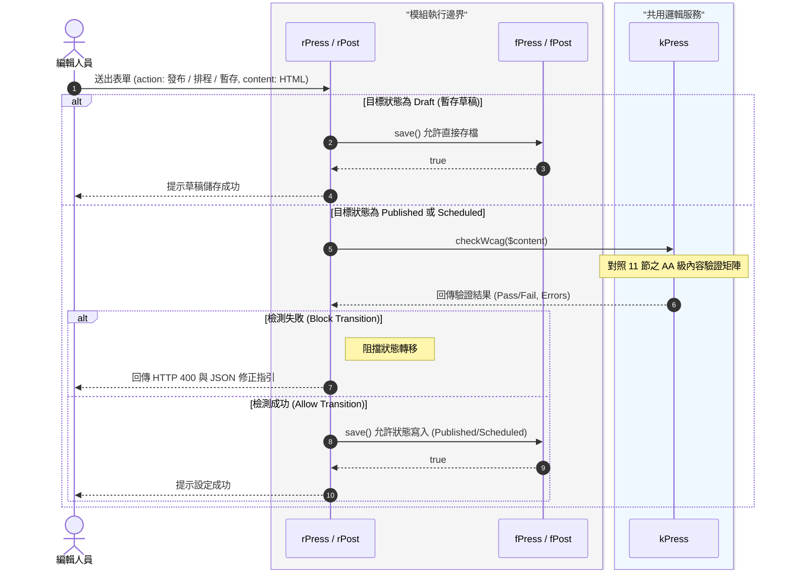

# 無障礙 AA 級自動檢測 (WCAG Auto-Checker) - idea.md (v7)

### 1. 背景與問題定義 (Problem Statement)
在現代化網站營運的合規要求下，對外發布的內容必須符合「無障礙網頁開發規範 2.1 版之 AA 等級」。編輯人員在上稿時，極易於 HTML 富文本編輯器 (WYSIWYG) 中產出不合規的語法結構。若系統缺乏明確的防呆機制，將導致網站面臨無障礙標章被撤銷的風險。因此，系統必須在內容「正式發布」或「設定排程」的卡點前進行自動化語法檢測，及時攔截不合規內容並給予修正指引。

### 2. 目標結果 (Target Outcome)
將無障礙語法自動檢測機制實作為一個純粹的「同步驗證防護閘門 (Synchronous Validation Guard)」。核心邏輯封裝於 `kPress`（跨模組邏輯服務）。系統不保留檢測歷史紀錄，當目標狀態為 `Published` 或 `Scheduled` 時即時觸發檢測；若違反明確定義的 AA 級內容規則，則阻擋狀態轉移，並回傳精確的 JSON 錯誤指引給前端。對於「暫存草稿 (Draft)」則提供寬容儲存機制，確保流暢的編輯體驗。

### 3. 範圍 (Scope)
*   **模組規則服務層 (`kPress`)**：實作無狀態的 `checkWcag(string $html)` 驗證方法。
*   **嚴格狀態轉移攔截 (`Reaction` 層)**：當 `Target Status` 為 `Published` / `Scheduled` 時，攔截 Payload 委派 `kPress` 檢測。
*   **草稿寬容機制 (Draft Tolerance)**：目標狀態為「草稿 (Draft)」時，允許儲存不合規的 HTML 內容，不阻擋寫入。
*   **具體化 AA 級驗證矩陣**：嚴格收斂 `kPress` 只需檢測「富文本編輯器可能產生的內容結構錯誤」（見第 11 節），不檢測全站佈景。

### 4. 非範圍 (Non-Scope)
*   **全站版面檢測 (Global Theme Validation)**：不檢測 Header, Footer, Menu, Color Contrast 等應由 `Outfit` 與 `Theme` 負責的全域版面無障礙規範。
*   **自動修復 (Auto-Fix)**：系統不主動竄改編輯者的 HTML 結構，避免破壞排版原意。
*   **排程層與歷史追蹤**：Cronjob 執行時不重複檢測；不建立 `_wcag_log` 等實體歷史追蹤表。

### 5. 核心物件與流程 (Core Objects or Processes)
*   **服務物件**：`kPress`。
*   **同步驗證流程**：編輯送出表單 -> `Reaction` 判斷目標狀態 -> 若為 Draft 直接存檔 -> 若為 Published / Scheduled 呼叫 `kPress` 檢測 -> 失敗即 return JSON Error 阻擋寫入 / 成功則交由 `Feed` 寫入資料庫。

### 6. 角色與參與者 (Actors and Roles)
*   **內容編輯者 (Content Editor)**：在上稿時根據系統即時回傳的指引修正內容；享有草稿暫存的自由度。
*   **Reaction (系統協調者)**：負責指揮流程與嚴格把關狀態轉移防護。
*   **kPress (系統驗證者)**：純粹的邏輯運算者。

### 7. 資料與狀態影響 (Data and State Implications)
*   **Schema 零異動 (Zero DDL)**：底層資料庫架構維持絕對靜態，不新增任何追蹤表。
*   **絕對的狀態轉移防護 (Strict Transition Guard)**：只要 `kPress` 驗證未通過，文章的 `status` 欄位**絕對不可**被寫入為 `Published` 或是 `Scheduled`。但允許寫入為 `Draft`。

### 8. 限制與依賴 (Constraints and Dependencies)
*   **外部函式庫依賴**：依賴輕量級 PHP DOM Parser 或 Node.js (CLI) 執行 DOM 樹檢測。
*   **效能要求 (Performance Constraint)**：檢測邏輯必須在同步 Request 的超時時間內完成。

### 9. 風險與未決問題 (Risks and Open Questions)
*   *(所有前置決策皆已收斂，包含具體驗證規則與草稿寬容機制，已無阻擋進入 plan 階段的未決問題。)*

### 10. 系統架構時序與分層邊界 (Sequence Diagram)


### 11. 無障礙 AA 級具體驗證規則合約 (WCAG AA Validation Rules Contract)
為避免實作漂移，`kPress` 的 `checkWcag()` 方法必須且僅須實作以下針對「富文本內容 (Content Payload)」的驗證邏輯。若觸犯以下任一規則，應回傳對應的 `rule_code` 與 `message`。

| 元素 (HTML Tag) | 驗證規則定義 (Business Rule) | 違反時回傳之 `rule_code` |
| :--- | :--- | :--- |
| `` | **必須具備替代文字**：所有 `` 標籤必須包含 `alt` 屬性，且不能僅為空白字元（若為裝飾性圖片可允許 `alt=""`，但屬性必須存在）。 | `WCAG_IMG_NO_ALT` |
| `<a>` | **另開視窗提示**：若連結包含 `target="_blank"`，必須具備 `title` 屬性或內部包含隱藏提示文字（如「另開新視窗」），以告知盲人使用者。 | `WCAG_A_BLANK_NO_WARN` |
| `<a>` | **超連結文字明確性**：`<a>` 標籤內必須有實質文字內容，不能僅有空白或無意義之字元。 | `WCAG_A_EMPTY_TEXT` |
| `<iframe>` | **內嵌框架標題**：所有 `<iframe>`（如 YouTube 影片、Google Maps）必須包含 `title` 屬性，說明該框架的內容用途。 | `WCAG_IFRAME_NO_TITLE` |
| `<table>` | **資料表格結構**：若使用 `<table>`，必須具備 `<caption>`（表格標題）或 `summary` 屬性，且表頭 `<th>` 必須包含 `scope` 屬性（row 或 col）。 | `WCAG_TABLE_STRUCTURE` |
| `<h1>`~`<h6>` | **標題階層合理性**：標題標籤必須依序遞增（例如不能在沒有 `<h2>` 的情況下直接使用 `<h4>`）。 | `WCAG_HEADING_ORDER` |

**JSON 錯誤回傳格式合約 (API Response Contract)**：
當 `Reaction` 收到 `kPress` 回傳錯誤時，應以如下 JSON 格式中斷請求，供前端編輯器反白標示錯誤位置：
```json
{
    "code": 8207,
    "data": {
        "msg": "發布失敗：內容不符合無障礙 AA 級規範，請修正後再試。",
        "validation_errors": [
            {
                "rule_code": "WCAG_IMG_NO_ALT",
                "message": "發現圖片缺少 alt 替代文字",
                "snippet": ""
            },
            {
                "rule_code": "WCAG_IFRAME_NO_TITLE",
                "message": "內嵌影片缺少 title 標題屬性",
                "snippet": "<iframe src='https://youtube.com/...'></iframe>"
            }
        ]
    },
    "csrf": "1106c15d142uz.1c270u8dj23z6"
}
```