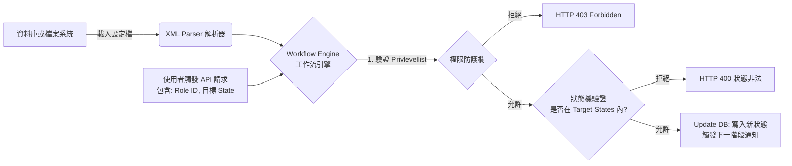
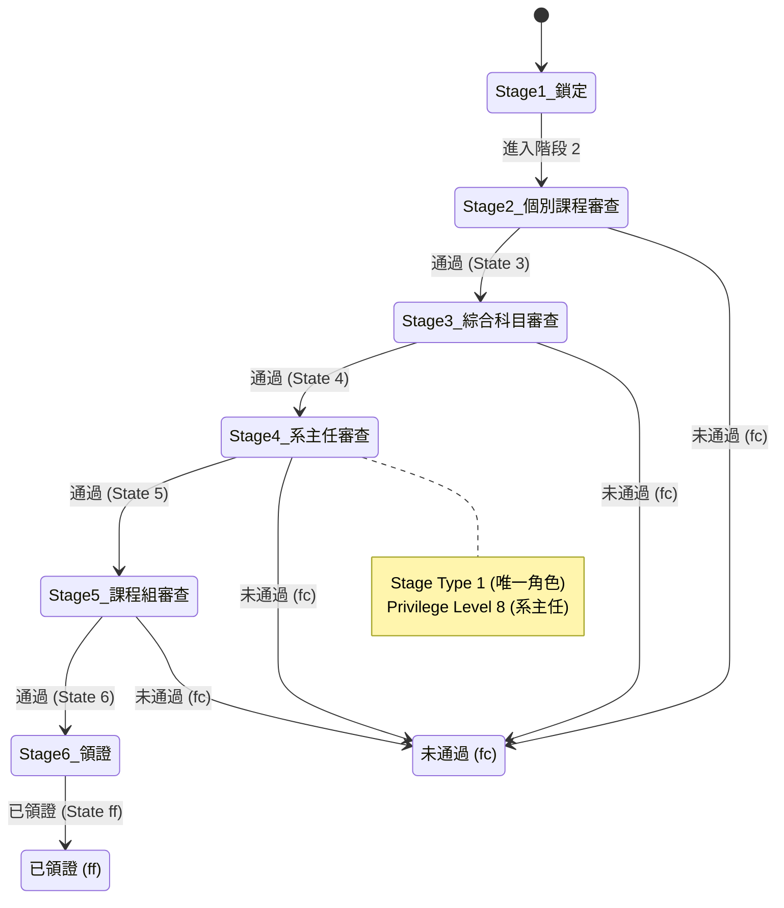

這是一份由資深系統分析師 (Senior Systems Analyst) 針對《flow_xml.docx》所進行的 **工作流引擎設定檔 (Workflow Engine Configuration)** 解析報告。

根據來源文件，這份 XML 規格書是早期為了將「商業邏輯 (Business Logic)」與「程式碼 (Source Code)」解耦，所設計的 **宣告式狀態機 (Declarative State Machine)**。系統透過讀取 XML 中的 `state code` (狀態)、`stage type` (節點處理類型：如必選、並行、擇一) 以及 `Privlevellist` (角色權限控制 Role-Based Access Control) 來決定公文的流轉方向。

## XML 與 JSON 版本的閱讀方式

本文件目前**同時保留兩種寫法**，用途不同：

1. 前段保留早期 XML 解析報告式寫法，用來保存 legacy workflow 規格的原始語意、歷史節點特性、角色設計與 edge case 背景。
2. 後段補上 JSON 版本，用來對應目前 WorkflowEngine 第一版已收斂的 runtime/source format 與現代化整合方向。

這不是兩套互相競爭的規格，而是同一份 `idea.md` 內的兩層材料：
- XML 區塊回答「舊系統原本怎麼表達流程」
- JSON 區塊回答「新 engine 準備如何承接這些流程」

因此本文件的閱讀順序應是：
1. 先看 XML 解析，理解 legacy flow 的原始設計與複雜度
2. 再看 JSON 版本，理解第一版 WorkflowEngine 準備如何把 legacy flow 轉為目前可維護的結構
3. 最後再看 discuss 結論，確認第一版真正定案的是什麼

為了展示該系統的涵蓋範圍與複雜度，我從文件中挑選了三個最具代表性的 XML 範例，分別代表 **「標準層級簽核」**、**「基礎評分審查」** 與 **「複雜分支路由」**：

---

### 代表性範例一：標準層級簽核流程

#### 📌 PSC (任教專門科目認證申請流程)

**SA 解析**：這是最標準的公文簽核流。展示了從申請人鎖定、系辦初審、系主任核准、到課程組最終發證的線性遞進結構。透過 `type="1"` (唯一角色) 與 `type="3"` (擇一) 的搭配，定義了不同關卡的簽核彈性。

```xml
<flow>
<title><![CDATA[任教專門科目認證申請流程]]></title>
<code><![CDATA[PSC]]></code>
<privid>29</privid>
<description><![CDATA[申請任教專門科目認證的全部流程]]></description>
<statelist>
<state code="ff"><![CDATA[已領證]]></state>
<state code="fe"><![CDATA[中止]]></state>
<state code="fd"><![CDATA[使用者中止]]></state>
<state code="fc"><![CDATA[未通過]]></state>
</statelist>
<stage type="5" code="1">
<title><![CDATA[鎖定]]></title>
<description><![CDATA[PSC由使用者自行鎖定]]></description>
<statelist>
<state code="2"><![CDATA[鎖定]]></state>
</statelist>
<privlevellist>
<level>0</level>
</privlevellist>
</stage>
<stage type="3" code="2">
<title><![CDATA[個別課程審查]]></title>
<description><![CDATA[PSC系辦個別課程審查]]></description>
<statelist>
<state code="3"><![CDATA[通過]]></state>
<state code="fc"><![CDATA[未通過]]></state>
</statelist>
<privlevellist>
<level>4</level>
</privlevellist>
</stage>
<stage type="3" code="3">
<title><![CDATA[綜合科目審查]]></title>
<description><![CDATA[PSC系辦綜合科目審查]]></description>
<statelist>
<state code="4"><![CDATA[通過]]></state>
<state code="fc"><![CDATA[未通過]]></state>
</statelist>
<privlevellist>
<level>4</level>
</privlevellist>
</stage>
<stage type="1" code="4">
<title><![CDATA[系主任審查]]></title>
<description><![CDATA[PSC系主任審查]]></description>
<statelist>
<state code="5"><![CDATA[通過]]></state>
<state code="fc"><![CDATA[未通過]]></state>
</statelist>
<privlevellist>
<level>8</level>
</privlevellist>
</stage>
<stage type="3" code="5">
<title><![CDATA[課程組審查]]></title>
<description><![CDATA[PSC課程組審查]]></description>
<statelist>
<state code="6"><![CDATA[通過]]></state>
<state code="fc"><![CDATA[未通過]]></state>
</statelist>
<privlevellist>
<level>2</level>
<level>16</level>
</privlevellist>
</stage>
<stage type="5" code="6">
<title><![CDATA[領證]]></title>
<description><![CDATA[PSC申請人領取任教專門科目認證]]></description>
<statelist>
<state code="ff"><![CDATA[已領證]]></state>
</statelist>
<privlevellist>
<level>2</level>
<level>16</level>
</privlevellist>
</stage>
</flow>
```

---

### 代表性範例二：基礎評分審查流程

#### 📌 QEII (優質實習輔導老師申請流程)

**SA 解析**：這是一個極簡化的「初審 ➔ 評分 ➔ 決審」三階段流程。特別值得注意的是 `Stage 3 (評分)` 的權限層級為 `<level>0</level>`，這在系統中代表該階段僅限「系統指定之特定評審人士」才能執行，展現了工作流引擎對動態權限 (Dynamic Assignment) 的支援能力。

```xml
<flow>
<title><![CDATA[優質實習輔導老師申請流程]]></title>
<code><![CDATA[QEII]]></code>
<privid>24</privid>
<description><![CDATA[申請優質實習輔導老師的全部流程]]></description>
<statelist>
<state code="ff"><![CDATA[通過]]></state>
<state code="fe"><![CDATA[中止]]></state>
<state code="fd"><![CDATA[使用者中止]]></state>
<state code="fc"><![CDATA[未通過]]></state>
</statelist>
<stage type="5" code="1">
<title><![CDATA[鎖定]]></title>
<description><![CDATA[由使用者自行鎖定]]></description>
<statelist>
<state code="2"><![CDATA[鎖定]]></state>
</statelist>
<privlevellist>
<level>0</level>
</privlevellist>
</stage>
<stage type="3" code="2">
<title><![CDATA[初審]]></title>
<description><![CDATA[QEII格式審查]]></description>
<statelist>
<state code="3"><![CDATA[通過]]></state>
<state code="fc"><![CDATA[未通過]]></state>
</statelist>
<privlevellist>
<level>2</level>
<level>4</level>
</privlevellist>
</stage>
<stage type="4" code="3">
<title><![CDATA[評分]]></title>
<description><![CDATA[QEII評委審查]]></description>
<statelist>
<state code="4"><![CDATA[通過]]></state>
<state code="fc"><![CDATA[未通過]]></state>
</statelist>
<privlevellist>
<level>0</level>
</privlevellist>
</stage>
<stage type="3" code="4">
<title><![CDATA[決審]]></title>
<description><![CDATA[QEII最終審查]]></description>
<statelist>
<state code="ff"><![CDATA[通過]]></state>
<state code="fc"><![CDATA[未通過]]></state>
</statelist>
<privlevellist>
<level>2</level>
<level>4</level>
</privlevellist>
</stage>
</flow>
```

---

### 代表性範例三：複雜分支路由與條件判斷

#### 📌 SJSE (中等教育季刊申請流程)

**SA 解析**：這是所有範例中最複雜的流程，完美展示了期刊審查的邊緣案例 (Edge Cases)。它不僅有標準的通過/未通過，還引入了 `9 (修正稿件)` 與 `A (送三審)` 這類**條件跳轉狀態**。最後的 `Stage A (選擇步驟)` 更允許使用者在多個歷史節點之間進行「逆向路由 (Reverse Routing)」，是一套具備高度彈性的工作流配置。

```xml
<flow>
<title><![CDATA[中等教育季刊申請流程]]></title>
<code><![CDATA[SJSE]]></code>
<privid>23</privid>
<description><![CDATA[投稿中等教育季刊的全部流程]]></description>
<statelist>
<state code="ff"><![CDATA[通過]]></state>
<state code="fe"><![CDATA[中止]]></state>
<state code="fd"><![CDATA[放棄]]></state>
<state code="fc"><![CDATA[未通過]]></state>
</statelist>
<stage type="5" code="1">
<title><![CDATA[鎖定]]></title>
<description><![CDATA[SJSE由使用者自行鎖定]]></description>
<statelist>
<state code="2"><![CDATA[鎖定]]></state>
</statelist>
<privlevellist>
<level>0</level>
</privlevellist>
</stage>
<stage type="3" code="2">
<title><![CDATA[格式審查]]></title>
<description><![CDATA[SJSE格式審查]]></description>
<statelist>
<state code="3"><![CDATA[通過]]></state>
<state code="fc"><![CDATA[未通過]]></state>
</statelist>
<privlevellist>
<level>2</level>
<level>8</level>
</privlevellist>
</stage>
/*初審階段*/
<stage type="4" code="3">
<title><![CDATA[初審評分]]></title>
<description><![CDATA[SJSE評委初審]]></description>
<statelist>
<state code="6"><![CDATA[通過]]></state>
<state code="9"><![CDATA[修正稿件]]></state>
<state code="A"><![CDATA[送三審]]></state>
<state code="fc"><![CDATA[未通過]]></state>
</statelist>
<privlevellist>
<level>0</level>
</privlevellist>
</stage>
/*複審階段*/
<stage type="4" code="4">
<title><![CDATA[複審評分]]></title>
<description><![CDATA[SJSE評委複審]]></description>
<statelist>
<state code="7"><![CDATA[通過]]></state>
<state code="9"><![CDATA[修正稿件]]></state>
<state code="fc"><![CDATA[未通過]]></state>
</statelist>
<privlevellist>
<level>0</level>
</privlevellist>
</stage>
/*三審階段*/
<stage type="4" code="5">
<title><![CDATA[三審評分]]></title>
<description><![CDATA[SJSE評委三審]]></description>
<statelist>
<state code="8"><![CDATA[通過]]></state>
<state code="fc"><![CDATA[未通過]]></state>
</statelist>
<privlevellist>
<level>0</level>
</privlevellist>
</stage>
/*總編輯核示階段*/
<stage type="1" code="6">
<title><![CDATA[初審核示]]></title>
<description><![CDATA[SJSE副總編輯初審最終審查]]></description>
<statelist>
<state code="ff"><![CDATA[通過]]></state>
<state code="fc"><![CDATA[未通過]]></state>
<state code="9"><![CDATA[修正稿件]]></state>
<state code="A"><![CDATA[送三審]]></state>
</statelist>
<privlevellist>
<level>4</level>
</privlevellist>
</stage>
<stage type="1" code="7">
<title><![CDATA[複審核示]]></title>
<description><![CDATA[SJSE副總編輯複審最終審查]]></description>
<statelist>
<state code="ff"><![CDATA[通過]]></state>
<state code="fc"><![CDATA[未通過]]></state>
<state code="9"><![CDATA[修正稿件]]></state>
<state code="A"><![CDATA[送三審]]></state>
</statelist>
<privlevellist>
<level>4</level>
</privlevellist>
</stage>
<stage type="1" code="8">
<title><![CDATA[三審核示]]></title>
<description><![CDATA[SJSE副總編輯三審最終審查]]></description>
<statelist>
<state code="ff"><![CDATA[通過]]></state>
<state code="fc"><![CDATA[未通過]]></state>
<state code="9"><![CDATA[修正稿件]]></state>
</statelist>
<privlevellist>
<level>4</level>
</privlevellist>
</stage>
<stage type="5" code="9">
<title><![CDATA[答辯]]></title>
<description><![CDATA[SJSE使用者答辯]]></description>
<statelist>
<state code="A"><![CDATA[已答辯]]></state>
<state code="fd"><![CDATA[放棄]]></state>
</statelist>
<privlevellist>
<level>0</level>
</privlevellist>
</stage>
<stage type="3" code="A">
<title><![CDATA[選擇步驟]]></title>
<description><![CDATA[SJSE地方組選擇步驟]]></description>
<statelist>
<state code="4"><![CDATA[複審]]></state>
<state code="5"><![CDATA[三審]]></state>
<state code="6"><![CDATA[副總編輯初審核示]]></state>
<state code="7"><![CDATA[副總編輯複審核示]]></state>
<state code="8"><![CDATA[副總編輯三審核示]]></state>
</statelist>
<privlevellist>
<level>2</level>
<level>8</level>
</privlevellist>
</stage>
</flow>
```

---

### 💡 系統分析師總結 (SA Conclusion)

將業務規則 (Business Rules) 以 XML 形式儲存，是早期降低系統維護成本的優秀設計。當系統讀取這些 XML 時，其底層解析與狀態流轉模型如下圖所示：



然而，值得注意的是，這些 `<privlevellist>` 中使用了如 `2`, `4`, `8`, `16` 等**硬編碼 (Hardcoded)** 的魔術數字，且不同流程 (如 PSC 與 SJSE) 的數字意義並不互通。若未來需進行現代化重構 (Modernization)，強烈建議將此類 XML 轉換為 JSON 或 BPMN 2.0 格式，並將魔術數字重構為具有領域意義的字串 (例如：`ROLE_DEPT_ADMIN`)，以利 API Gateway 進行統一的存取控制 (Access Control)。

這是一份來自資深系統分析師 (Senior Systems Analyst) 針對《flow_xml.docx》所進行的 **系統規格解析與技術債評估報告 (System Specification & Technical Debt Assessment)**。

從這份建立於 2009 年的文件可以看出，這是一個早期為了處理校務行政（如教育實習、專門科目認證、期刊審查等）所開發的 **工作流引擎 (Workflow Engine)** 配置規格。

以下我將從系統架構的視角，為您拆解這份規格的用途、亮點，以及在現代 IT 標準下的潛在風險。

---

### Phase 1: 規格用途解析 (System Purpose & Context)

**核心用途 (Core Purpose)**： 這份 XML 文件的主要用途是作為 **「宣告式狀態機 (Declarative State Machine)」** 的設定檔。 它將複雜的商業邏輯（如：誰在什麼階段可以審核、審核通過後進入哪一個狀態）從主程式碼中抽離出來，交由 XML 統一配置。當系統載入特定流程（如 `PSC` 任教專門科目認證）時，會讀取對應的 XML 來決定流程走向與介面權限。

**運作邏輯視覺化 (Workflow Visualization)**： 以文件中的 `PSC` (任教專門科目認證申請) 為例，系統是這樣解析 XML 並流轉狀態的：



---

### Phase 2: 架構優勢評估 (Architectural Advantages)

在 2009 年的時空背景下，這套設計具備了極高的前瞻性，展現了良好的 **關注點分離 (Separation of Concerns)**：

1. **業務邏輯解耦 (Decoupled Business Logic)** 透過 XML 標籤 `<stage>`、`<statelist>` 與 `<privlevellist>`，系統工程師不需要將「系辦審查完換系主任審查」這種邏輯寫死 (Hardcoding) 在程式碼裡。未來若要新增一個「教育實習變更指導系所 (EICD)」的流程，只需新增一段 XML，系統核心引擎完全不用修改。
2. **靈活的節點類型設計 (Flexible Stage Types)** 文件定義了 5 種 `stage type` (如：1=唯一角色、2=並行、3=擇一)。這種設計能夠完美映射現實世界中複雜的公文簽核情境。例如「擇一 (Type 3)」允許多位評委中只要一人核准即可放行，大幅提升了系統的應用彈性。
3. **標準化的終端狀態合約 (Standardized State Codes)** 強制定義 16 進位的保留字（`ff`: 通過、`fe`: 中止、`fc`: 未通過），讓前端 UI 可以透過統一的邏輯來渲染按鈕或顯示最終結果，這是一套非常乾淨的 API Contract 設計。

---

### Phase 3: 缺點與潛在技術債 (Disadvantages & Technical Debt)

以現代化系統架構與資訊安全的標準來檢視，這份規格隱藏了幾個嚴重的維運地雷 (Bottlenecks)：

1. **權限魔術數字 (Magic Numbers in RBAC)** 這是這份規格最大的致命傷。在 `<privlevellist>` 中使用了數字代碼，但**各系統的代碼意義完全不一致**。
    
    - _在 PSC 流程中_：4 = 系辦管理、8 = 系主任管理。
    - _在 EI 流程中_：16 = 系辦管理、32 = 系主任管理。
    - _在 SJSE 流程中_：8 = 監察。 這種**缺乏全域統一角色定義 (Global Role-Based Access Control)** 的設計，會導致系統維護人員在除錯時極度痛苦，且非常容易因為代碼填錯而發生「越權存取 (Privilege Escalation)」的重大資安漏洞。
2. **缺乏逆向與分支路由能力 (Rigid Routing Logic)** XML 中只定義了每個 Stage 有哪些 State（例如通過或未通過），但**沒有定義狀態之間的轉移路徑 (Transition Mapping)**。 例如：當 Stage 4 退件 (fc) 時，系統是直接結案？還是退回 Stage 3？還是退回申請人？從這份 XML 結構中看不出來。這意味著「退件後的走向」很可能還是被寫死在後端程式碼中，失去了 Workflow Engine 應有的動態路由能力。
    
3. **XML 格式過於冗長且不利於 API 傳輸 (Payload Overhead)** XML 格式夾帶了大量的標籤（如 `<![CDATA[...]]>`），在現代前後端分離 (SPA + RESTful API) 的架構中，這種格式解析成本高且浪費頻寬。
    

---

### Phase 4: SA 的系統重構建議 (Modernization Recommendations)

如果您目前正在評估是否要沿用、升級或替換這套 2009 年的舊系統，我會給予以下建議：

1. **升級至 BPMN 2.0 或 JSON 規格 (Migration to Modern Standards)** 放棄自定義的 XML 解析器，改用現代化的工作流引擎（如 Camunda 或 Activiti），或是將設定檔輕量化轉為 JSON 格式。這將大幅提升系統與現代 Web 技術的相容性。
2. **重構權限設計 (Refactor to Standard RBAC)** 拔除「1, 2, 4, 8, 16」這種 Bitwise 的魔術數字權限。將 `<privlevellist>` 的內容改為具備業務意義的字串（如 `ROLE_DEPT_ADMIN`, `ROLE_DIRECTOR`），並在系統中建立統一的權限對應表，徹底消除權限混亂的技術債。
3. **補齊狀態轉移矩陣 (Implement Transition Matrix)** 在規格中加入 `TargetStage` 的定義，讓 XML/JSON 能夠明確指出：「當發生退件 (fc) 時，請跳轉至 Stage 2」，真正實現 100% 透過設定檔控制業務流轉。

### 為何由 XML 轉換到 JSON

保留 XML 解析報告，不代表第一版仍要以 XML 作為 runtime 格式。由 XML 轉向 JSON 的原因，已可收斂為以下幾點：

1. XML 更適合作為 legacy 規格與歷史語意的分析材料；JSON 更適合作為目前 engine 的直接輸入格式。
2. XML 原始結構缺少明確 transition mapping，許多流轉語意仍混在舊程式或隱性規則裡；轉為 JSON 時，剛好可以一併補齊 stage、transition、role constant、join policy 等現代 engine 所需欄位。
3. JSON 對目前 F3CMS 的 module-first 整合路徑更直接：module 可先取得目標流程 JSON，再初始化 `libs/WorkflowEngine`，不需要讓 engine 在 runtime 直接背負 XML parser 與 legacy 格式相容層。
4. JSON 較容易和目前的 PHP array、API payload、smoke fixture、module-local `flow.json` 對齊，能降低 parser 與傳輸成本。
5. XML 的歷史價值仍然重要，所以這裡保留 XML 解析報告；但第一版的可執行契約，已改由 JSON 版本承接。

這是一份由資深系統分析師 (Senior Systems Analyst) 所製作的 **資料結構轉換報告 (Data Structure Transformation Report)**。

以下 JSON 區塊不是要覆蓋前面的 XML 報告，而是作為 WorkflowEngine 第一版承接 legacy flow 的現代化版本。

將 2009 年的 legacy XML 設定檔轉換為現代化的 **JSON (JavaScript Object Notation)** 格式，是系統重構 (System Refactoring) 與導入前後端分離架構 (如 RESTful API、SPA) 的關鍵基礎。

以下我將原始的 `PSC` (任教專門科目認證申請流程) XML 內容，重新塑模 (Remodeling) 為具備高可讀性的 JSON Payload，並附上技術設計說明。

---

### Phase 1: 結構化 JSON 呈現 (Structured JSON Payload)

在這個設計中，我移除了 XML 冗長的 `<![CDATA[...]]>` 標籤，將重複的節點轉為標準的 **陣列 (Arrays)**，並將屬性 (Attributes) 與內容轉為 **鍵值對 (Key-Value Pairs)**，以最小化傳輸負載 (Payload Overhead)：

```json
{
  "workflow": {
    "title": "任教專門科目認證申請流程",
    "code": "PSC",
    "privilegeId": 29,
    "description": "申請任教專門科目認證的全部流程",
    "globalStates": [
      { "code": "ff", "label": "已領證" },
      { "code": "fe", "label": "中止" },
      { "code": "fd", "label": "使用者中止" },
      { "code": "fc", "label": "未通過" }
    ],
    "stages": [
      {
        "stageCode": "1",
        "stageType": 5,
        "title": "鎖定",
        "description": "PSC由使用者自行鎖定",
        "targetStates": [
          { "code": "2", "label": "鎖定" }
        ],
        "privilegeLevels":
      },
      {
        "stageCode": "2",
        "stageType": 3,
        "title": "個別課程審查",
        "description": "PSC系辦個別課程審查",
        "targetStates": [
          { "code": "3", "label": "通過" },
          { "code": "fc", "label": "未通過" }
        ],
        "privilegeLevels":
      },
      {
        "stageCode": "3",
        "stageType": 3,
        "title": "綜合科目審查",
        "description": "PSC系辦綜合科目審查",
        "targetStates": [
          { "code": "4", "label": "通過" },
          { "code": "fc", "label": "未通過" }
        ],
        "privilegeLevels":
      },
      {
        "stageCode": "4",
        "stageType": 1,
        "title": "系主任審查",
        "description": "PSC系主任審查",
        "targetStates": [
          { "code": "5", "label": "通過" },
          { "code": "fc", "label": "未通過" }
        ],
        "privilegeLevels":
      },
      {
        "stageCode": "5",
        "stageType": 3,
        "title": "課程組審查",
        "description": "PSC課程組審查",
        "targetStates": [
          { "code": "6", "label": "通過" },
          { "code": "fc", "label": "未通過" }
        ],
        "privilegeLevels":
      },
      {
        "stageCode": "6",
        "stageType": 5,
        "title": "領證",
        "description": "PSC申請人領取任教專門科目認證",
        "targetStates": [
          { "code": "ff", "label": "已領證" }
        ],
        "privilegeLevels":
      }
    ]
  }
}
```

---

### Phase 2: JSON Schema 設計理念與 SA 評估 (Schema Design & Evaluation)

在從 XML 轉移到 JSON 的過程中，我對 Data Model 進行了以下優化與標記：

1. **結構扁平化與陣列化 (Flattening & Array Normalization)**
    - 原本 XML 中的 `<statelist>` 被轉換為清晰的 `globalStates` (全域狀態) 與 `targetStates` (各階段的目標狀態陣列)。這讓前端 UI (如 Gene Panel) 能夠輕易地透過 `array.map()` 渲染出按鈕或下拉選單。
2. **屬性重命名 (Property Renaming for Readability)**
    - 將 XML 的 `type` 與 `code` 明確區分為 `stageType` (階段類型) 與 `stageCode` (階段代碼)，避免物件導向綁定時的命名衝突。
3. **權限陣列化 (Role Array)**
    - 原本的 `<privlevellist>` 含有多個 `<level>` 標籤，在 JSON 中被完美壓縮成如 `` 的整數陣列。

#### 💡 系統分析師的技術債預警 (Technical Debt Warning)

雖然我們已經將資料格式從 XML 現代化為 JSON，但這份 Payload **依然保留了「領域邏輯的魔術數字 (Magic Numbers)」**。

如果未來要將這份 JSON 直接餵給新一代的引擎，我強烈建議在後端 (API Layer) 進行二次轉換 (Mapping)，將這些數字替換成強型別的 Enum 字串，以確保後續維護的安全性：

- `stageType: 3` 應轉換為 `"type": "ANY_APPROVE"` (擇一通過)
- `privilegeLevels:` 應轉換為 `"roles": ["DEPT_ADMIN"]` (系辦管理)
- `privilegeLevels:` 應轉換為 `"roles": ["DEPT_CHAIR"]` (系主任管理)

這是一份由資深系統分析師 (Senior Systems Analyst) 為您規劃的 WorkflowEngine 用例收斂稿。

在目前已確認的 F3CMS 用例中，WorkflowEngine 應位於 `libs/`，作為共用 workflow 核心元件；它不是某個單一 module 的私有 Kit，也不是只能由單一層呼叫的 parser。各 module 在需要進行流程判定、檢查或流轉操作時，可由 `Reaction`、`Outfit` 或 `Kit` 先取得該筆業務對應的目標流程 JSON，再初始化 `WorkflowEngine`，後續以 engine 提供的方法完成驗證、判定與操作。

### Phase 1: WorkflowEngine 用例定位

目前收斂後的用例如下：

1. `WorkflowEngine` 位於 `libs/`。
2. `Reaction`、`Outfit`、`Kit` 都可以在各自需要的情境下呼叫它。
3. module 不是只傳 `workflow_code` 給 engine，而是先取得目標流程 JSON，再初始化 engine。
4. engine 初始化完成後，再由其函式進行：
   - definition 驗證
   - 權限檢查
   - 當前 stage / action 判定
   - transition 合法性檢查
   - 流程推進或其他 workflow 操作
5. workflow 的操作紀錄不由 `WorkflowEngine` 自帶專屬資料表保存，而是由各 module 自己承接到對應的 log table。
  - 例如：`Press` 對應 `press_log`
  - 例如：`Order` 對應 `order_log`
  - 這裡的 `press_log`、`order_log` 是 module-owned workflow log 的概念名稱；實際落地時仍應依各 module 當前資料表命名，例如 `Press` 目前的實際表名是 `tbl_press_log`
  - 這些 log 至少應能保存 staff id、操作時間、舊狀態、新狀態，以及必要的 action / remark / workflow context

### Phase 2: 建議介面形態

在此用例下，WorkflowEngine 的第一版建議採 instance-based 用法，而不是只暴露一組先查 DB 再判斷的靜態函式。

```php
class WorkflowEngine
{
  public function __construct($workflowJson)
  {
    // 接受 module 傳入的目標流程 JSON
    // 可接受原始 JSON 字串或已 decode 的 array
  }

  public function validateDefinition(): bool
  {
    // 驗證 JSON contract 是否完整
  }

  public function project($runtimeContext = []): array
  {
    // 根據目前 instance / stage / state / role context
    // 回傳目前 stage、available actions、next-step judgment
  }

  public function canTransit($actionCode, $runtimeContext = []): bool
  {
    // 驗證 action 是否可執行
  }

  public function transit($actionCode, $runtimeContext = []): array
  {
    // 執行 workflow transition，回傳判定結果
  }
}
```

### Phase 3: 各層呼叫方式

`Reaction` 的典型用法：
- 接收 action request
- 取得對應 workflow JSON
- 初始化 engine
- 呼叫 engine 驗證可否執行某個 action
- 驗證通過後，先把本次 transition 所需的操作紀錄寫入 module 自己的 log table，再進入 Feed 或其他寫回路徑

`Outfit` 的典型用法：
- 取得 workflow JSON 與目前業務狀態
- 初始化 engine
- 呼叫 engine 取得目前 stage、可顯示 action、下一步判斷
- 將結果轉成頁面渲染所需資料

`Kit` 的典型用法：
- 封裝 module-local 的 workflow helper
- 組合 module context 與 workflow JSON
- 呼叫 engine 做共用判斷

### Phase 3.5: Module-owned Log 邊界

在目前已確認的第一版邊界中，WorkflowEngine 雖然要支援 transition、role guard、rollback、branch、parallel 等能力，但它不負責擁有共用 workflow log table。

第一版新增限制如下：
- 各 module 在透過 WorkflowEngine 控制 flow 時，應有自己的 log table
- log table 命名應跟隨 module 業務語意，例如 `press_log`、`order_log`
- `press_log`、`order_log` 用於討論 module log 這個概念實體；實際資料表名仍以 module 既有命名為準，例如 `tbl_press_log`
- log 的持久化責任屬於 module，而不是 `libs/WorkflowEngine`

第一版至少要能記錄：
- `staff_id`
- 操作時間
- 舊狀態
- 新狀態
- `action_code` 或等價操作識別
- 必要的 remark / 補充 context

這個限制的重點是：
- 被否決的是「WorkflowEngine 自帶專屬 log / trace 表」
- 不是被否決「workflow transition 需要留下可追蹤的操作紀錄」

### Phase 4: 實際應用範例

以下展示 module 先取得目標流程 JSON，再初始化 `libs/WorkflowEngine` 的典型用法：

```php
// 1. 由 module 先取得這筆業務對應的目標流程 JSON
$workflowJson = $pressWorkflowJson;

// 2. 初始化 libs/WorkflowEngine
$engine = new WorkflowEngine($workflowJson);

// 3. 先做 definition 驗證
$engine->validateDefinition();

// 4. 以 runtime context 判定目前可執行步驟
$projection = $engine->project([
  'current_stage_codes' => ['DRAFT'],
  'current_state_code' => 'Draft',
  'operator_role_constant' => 'ROLE_PUBLISHER',
]);

// 5. 在需要時執行 transition
$result = $engine->transit('PUBLISH', [
  'current_stage_codes' => ['DRAFT'],
  'current_state_code' => 'Draft',
  'operator_role_constant' => 'ROLE_PUBLISHER',
  'operator_id' => 1,
]);

// 6. 由 module 自己寫入對應的業務 log table，例如 press_log
//    欄位至少包含：staff_id、action_code、old_status、new_status、created_at
```

這個用例的重點不是 engine 自己決定去哪裡讀 definition，而是 module 先取得正確的目標流程 JSON，再把它交給位於 `libs/` 的 WorkflowEngine 做判定與操作。

    // 檢核 3：判斷是否流程結束
    if ($engine->isGlobalTerminalState($actionTargetState)) {
        echo "=> 審核完成：流程已進入終端狀態 [ " . $engine->getStateLabel($actionTargetState) . " ]。結案。\n";
    } else {
        echo "=> 審核完成：公文已成功流轉至下一個節點 [ 階段 {$actionTargetState} ]。\n";
    }

    // 在這裡呼叫 F3CMS 的 Feed 層，執行 UPDATE Database 寫入新的狀態與 last_ts
    // Feed::updateState($workOrderId, $actionTargetState);

} catch (Exception $e) {
    echo "[X] 錯誤：" . $e->getMessage() . "\n";
}

```

---

### SA 架構解析與價值 (Architectural Value)

實作這個 `WorkflowEngine` 類別，完全體現了我們討論過的 **「減少技術債與義大利麵條程式碼」** 的設計哲學：

1. **職責分離 (Separation of Concerns)**： F3CMS 的 `Feed` 層只需單純地進行 `UPDATE status = '3'`，它不需要知道「為什麼可以變成 3」。所有的「狀態機能不能動、誰可以動」，全部交由這個 `WorkflowEngine` 統一判斷。這使得核心邏輯極度純淨。
2. **防禦性設計 (Defensive Programming)**： 我們在引擎內實作了 `isValidTransition()`。如果有人企圖透過 Postman 惡意竄改 API，想把階段 `2 (個別課程審查)` 直接改成 `ff (已領證)`，引擎會立刻發現這不在 `targetStates` 陣列中，並予以阻擋。
3. **O(1) 的效能優化 (Performance Optimization)**： 在 `__construct` 時，類別會自動將 JSON 陣列轉換為 PHP 的關聯陣列 (Hash Map: `stageMap`)。因此在進行狀態檢查時，不需要跑 `foreach` 迴圈去逐一比對，直接用 `$this->stageMap[$stageCode]` 即可命中，確保在高併發環境下的極致效能。

---

## 目前已收斂的結論

以下結論已可直接沿用，不需要回到最前面重做：

1. 來源系統的核心本質是「宣告式工作流設定」，而不是單純的畫面表單或單一 API。
2. 舊規格至少包含三種重要能力：
  - 階段化流程控制
  - 狀態轉移控制
  - 角色權限控制
3. 舊系統的主要技術債已大致辨識完成：
  - 權限魔術數字
  - 狀態轉移路徑不夠明確
  - XML 格式冗長且不利於現代系統整合
4. 這個 feature 的目標方向明顯不是「原樣照抄 XML」，而是要把舊工作流規格轉成較可維護、可程式化、可延伸的新結構。

## 需回退確認的前置假設

目前文件後半段已經提前進入解法設計，但以下假設尚未在 discuss 階段正式確認，因此不宜直接拿去寫 `plan.md`：

1. 前段 XML 解析報告與後段 JSON 版本的角色不同，不能把「保留 XML 分析材料」誤讀為「第一版 runtime 仍應直接吃 XML」。
  - 對應段落：前段 XML 解析報告、`Phase 4: SA 的系統重構建議` 與後續 `資料結構轉換報告`
2. 「WorkflowEngine 只應由 Kit / Outfit 呼叫」目前不是已定案說法；正確邊界應回到後段 discuss 決議與 module 呼叫契約。
  - 對應段落：前述 `WorkflowEngine Parser` 舊範例
3. 「第一版就要實作完整 parser + transition guard + role guard」目前也還沒有經過範圍切分。
  - 對應段落：`WorkflowEngine.php` 類別與 `Usage Example`

上面這些段落不需要刪除，但在進入 `plan` 前，必須先回到 discuss 階段確認哪些是假設、哪些是真正要做的第一版範圍。

## 進入 plan 前待決議議題

以下議題是目前最需要先收斂的 discuss 清單。這些問題若不先決定，`plan.md` 很容易直接滑向特定解法，而不是正確拆解工作。

### 1. 第一版的交付目標是什麼
- 是先完成「舊 XML 規格解析報告」
- 還是先完成「可落地的資料模型設計」
- 還是直接做出「可執行的 workflow engine MVP」

### 2. 第一版是否要保留 XML 作為來源格式
- 直接讀 XML
- 先轉成 JSON 再使用
- 改成新的資料表或設定格式

這一題會直接影響後續 schema、parser、匯入流程與維運方式。

### 3. Workflow Engine 在 F3CMS 中的邊界是什麼
- 它是一個獨立 Module
- 一組共用 Kit / Service
- 還是某個既有模組底下的支援能力

### 4. 最小可用能力要包含哪些功能
- 僅解析流程定義
- 驗證角色權限
- 驗證狀態轉移
- 寫入流程實例目前狀態
- 支援退回、分支、並行、擇一等進階節點類型

第一版若不先切最小範圍，後面會直接變成大規模重構案。

### 5. 權限模型是否要同步重構
- 先沿用舊有 magic numbers
- 先做 mapping layer
- 還是第一版就全面轉為具業務語意的角色代碼

### 6. 流程定義與流程實例要不要分開建模
- 流程定義：描述 stage、state、role、transition
- 流程實例：描述某一筆案件目前跑到哪裡、由誰處理過、何時轉移

若這題不先釐清，資料表與 Feed 設計會很容易混在一起。

### 7. 第一版要不要處理歷史 edge cases
- 例如 SJSE 的逆向路由、修正稿件、送三審
- 還是先只支援線性流程與基本分支

### 8. workflow 操作紀錄應由哪一層承接
- 由 WorkflowEngine 自帶共用 log table
- 由各 module 自己的 log table 承接
- 或先沿用既有業務 log / trace 機制

這一題會直接影響 module schema、transaction 邊界、audit trail 與驗收方式。

### 9. 驗收成功的定義是什麼
- 能正確解析至少一份代表性流程
- 能阻擋非法 transition
- 能做基本 role guard
- 能在 F3CMS 中被某個模組實際呼叫

## 建議的下一步

不要直接開始寫 `plan.md`。

下一步應該是根據上面的「進入 plan 前待決議議題」，先做一輪 discuss 收斂，至少把以下三題定下來：

1. 第一版交付目標
2. 來源格式策略（XML / JSON / DB）
3. 在 F3CMS 中的邊界位置（獨立 module 或共用 kit/service）
4. workflow 操作紀錄由 WorkflowEngine 還是 module log table 承接

這三題一旦定下來，才適合開始撰寫 `document/spec/WorkflowEngine/plan.md`。

---

## Discuss 決議紀錄

以下為本輪 discuss 已確認的問題與回應，後續 `plan.md` 應直接沿用，不需重複討論。

### 問題 1：Workflow Engine 在 F3CMS 中的邊界位置是什麼

回應：
- 建立一個位於 `libs/` 內的 workflow engine
- 此 engine 應可被各 Module 的 `Reaction` / `Outfit` / `Kit` 呼叫，用來決定當下步驟與可執行的流轉行為

補充解讀：
- 這代表第一版不以獨立 Module 為前提
- 目前較接近「共用核心元件」而非單一業務模組

### 問題 2：第一版的來源格式策略是什麼

回應：
- 以 JSON 為資料來源

補充解讀：
- 目前可先不以 XML 作為 runtime 格式
- 舊 XML 可視為遷移來源，但新 engine 的直接輸入格式以 JSON 為準
- module 在需要時應先取得目標流程 JSON，再以該 JSON 初始化 engine

補充說明：
- 這也代表 `idea.md` 應同時保留 XML 解析報告與 JSON 版本
- XML 區塊用來保存 legacy 語意與遷移背景
- JSON 區塊用來表達第一版 WorkflowEngine 準備採用的承接格式

### 問題 3：第一版要支援哪些節點能力

回應：
- 支援退回
- 支援分支
- 支援並行
- 支援擇一等進階節點類型

補充解讀：
- 第一版不是只做線性流程 MVP
- `plan.md` 必須明確拆出這些節點能力的資料模型、解析規則與驗收方式

### 問題 4：權限模型是否要沿用舊有魔術數字

回應：
- 全面轉為具業務語意的角色代碼常數

補充解讀：
- 不再接受直接以 `2`、`4`、`8`、`16` 這類數字作為長期設計
- `plan.md` 應包含角色代碼常數化與 mapping 策略

### 問題 5：流程定義與流程實例是否分開建模

回應：
- 流程定義與流程實例要分開

補充解讀：
- 至少需要區分：
  - workflow definition
  - workflow instance
- 後續 schema、Feed 與 engine API 都應沿用這個分層

### 問題 6：是否要處理歷史 edge cases

回應：
- 要處理歷史 edge cases

補充解讀：
- 不能只用簡化案例驗證 engine
- `plan.md` 與 `check.md` 應納入舊流程中的複雜分支、退回與特殊節點情境

### 問題 8：workflow 操作紀錄應由哪一層承接

回應：
- 由各 module 自己的 log table 承接

補充解讀：
- `WorkflowEngine` 不擁有共用 workflow log table
- `Press` 這類 module 在導入 workflow 後，應有自己的 `press_log`
- `Order` 這類 module 在導入 workflow 後，應有自己的 `order_log`
- `plan.md` 應把 staff id、操作時間、新舊狀態等欄位列入 module log 的最小要求

### 問題 9：第一版驗收至少要達成什麼程度

回應：
- 能在 F3CMS 中被某個模組實際呼叫

補充解讀：
- 驗收不能只停在 parser 或純 library unit concept
- 至少要有一個實際 module integration 的呼叫情境

## 本輪 discuss 結論

目前已經足以進入 `plan`，因為以下核心決策已明確：
- engine 放在 `libs/`，由各 Module 呼叫
- runtime 資料來源採 JSON，且 module 以目標流程 JSON 初始化 engine
- 第一版就支援進階節點類型與歷史 edge cases
- 權限模型改為具業務語意的角色代碼常數
- 流程定義與流程實例分離
- workflow 操作紀錄由 module 自己的 log table 承接，而不是由 WorkflowEngine 自帶專屬表
- 驗收必須包含實際模組呼叫場景

下一步應開始撰寫 `document/spec/WorkflowEngine/plan.md`，把上述決議拆成可執行 stage。

